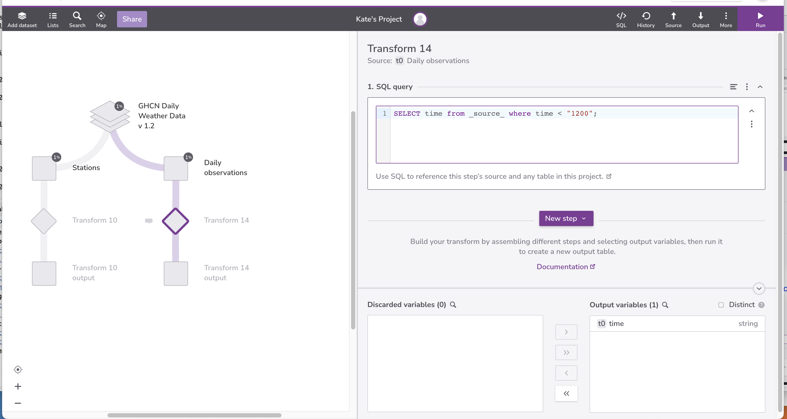
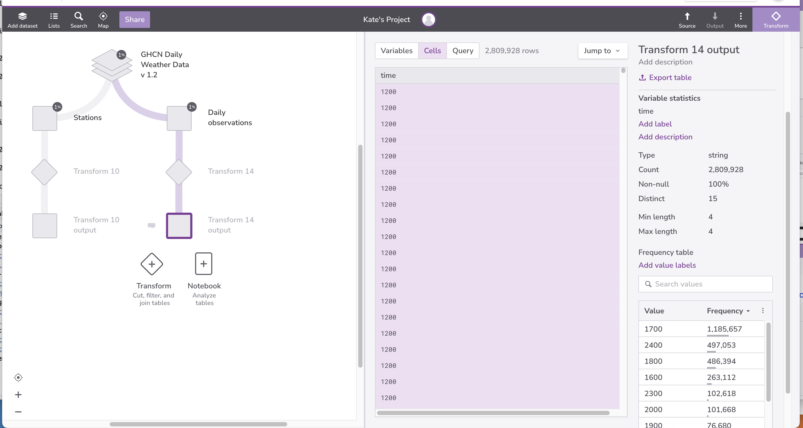
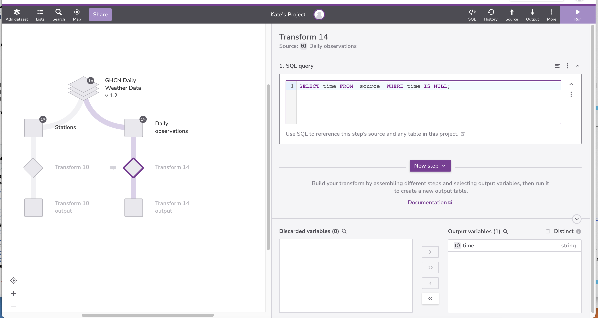
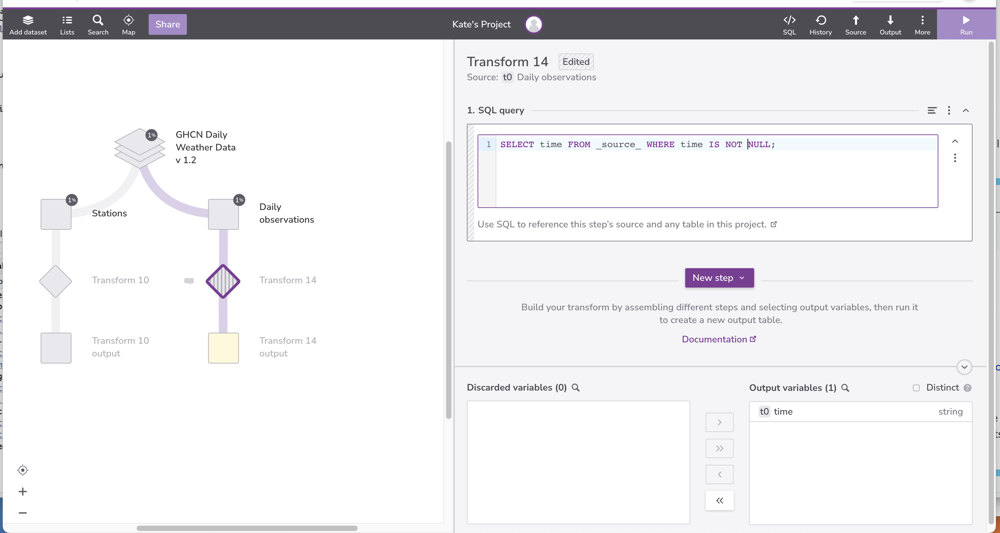
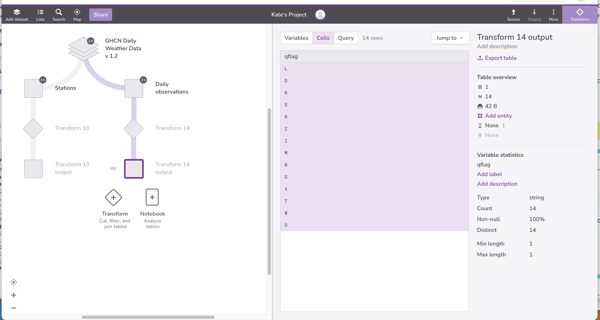

::::::::::::::::::::::::::::::::::::::: objectives

- Explain how databases represent missing information.
- Explain the three-valued logic databases use when manipulating missing information.
- Write queries that handle missing information correctly.

::::::::::::::::::::::::::::::::::::::::::::::::::

:::::::::::::::::::::::::::::::::::::::: questions

- How do databases represent missing information?
- What special handling does missing information require?

::::::::::::::::::::::::::::::::::::::::::::::::::

Real-world data is never complete --- there are always holes.
Databases represent these holes using a special value called `null`.
`null` is not zero, `False`, or the empty string;
it is a one-of-a-kind value that means "nothing here".
Dealing with `null` requires a few special tricks
and some careful thinking.


To start,
let's have a look at the `Daily observations` table. 
If you look at the `time` variable frequency table, there are 20,264,371 `null` values.

{#id .class border=5px alt=''}


Null doesn't behave like other values.
If we select the records that are less than "1200" we get 3,400,669 results.

```sql
SELECT time from _source_ where time < "1200";
```

{#id .class border=5px alt=''}

{#id .class border=5px alt=''}


If we select the records that are greater than or equal to “1200” we get 2,809,928 results.
```sql
SELECT time from _source_ where time >= "1200";
```

{#id .class border=5px alt=''}

{#id .class border=5px alt=''}

Why aren't the `null` values appearing in the results sets? The reason is that
`null<'1200'` and `null>='1200'`
are neither true nor false:
null means, "We don't know,"
and if we don't know the value on the left side of a comparison,
we don't know whether the comparison is true or false.
Since databases represent "don't know" as `null`,
the values of `null<'1200'` and `null>='1200'`
are both `null`. And since the only records kept by a `WHERE`
are those for which the test is true,
the `null` values aren't included in either set of results.


To check whether a value is `null` or not,
we must use a special test `IS NULL`:

```sql
SELECT time FROM _source_ WHERE time IS NULL;
```


{#id .class border=5px alt=''}

{#id .class border=5px alt=''}

or its inverse `IS NOT NULL`:

```sql
SELECT time FROM _source_ WHERE time IS NOT NULL;
```

{#id .class border=5px alt=''}

{#id .class border=5px alt=''}


Null values can cause headaches wherever they appear.
For example,
suppose we want to find all the measurements
except for those taken at "2400."
It's natural to write the query like this:

```sql
SELECT * FROM _source_ WHERE time != '2400';
```

but this query filters omits the records
where the time is unknown (or `null`).
Once again,
the reason is that when `time` is `null`,
the `!=` comparison produces `null`,
so the `null` records aren't kept in our results.


{#id .class border=5px alt=''}

{#id .class border=5px alt=''}


If we want to keep these records
we need to add an explicit check:

```sql
SELECT * FROM _source_ WHERE (time != '2400' OR time IS NULL);
```

{#id .class border=5px alt=''}

{#id .class border=5px alt=''}


We still have to decide whether this is the right thing to do or not.
If we want to be absolutely sure that
we aren't including any measurements taken at '2400' in our results,
we need to exclude all the records for which we don't the time of the measurement.


In contrast to arithmetic or Boolean operators, aggregation functions
that combine multiple values, such as `min`, `max` or `avg`, *ignore*
`null` values. In the majority of cases, this is a desirable output:
for example, unknown values are thus not affecting our data when we
are averaging it. Aggregation functions will be addressed in more
detail in [the next section](06-agg.md).

:::::::::::::::::::::::::::::::::::::::  challenge

## Sorting by Known Date

Using the `Daily observations table`, generate a list of unique qflags,
omitting entries for which the qflag is not known
(i.e., is null).

:::::::::::::::  solution

## Solution

```sql
SELECT DISTINCT qflag FROM _source_ WHERE qflag IS NOT NULL;
```

{#id .class border=5px alt=''}

{#id .class border=5px alt=''}

:::::::::::::::::::::::::

::::::::::::::::::::::::::::::::::::::::::::::::::

:::::::::::::::::::::::::::::::::::::::  challenge

## NULL in a Set

What do you expect the following query to produce?

```sql
SELECT * FROM _source_ WHERE time IN ('2400', '2300', NULL);
```

What does it actually produce?

:::::::::::::::  solution

## Solution

You might expect the above query to return rows where `time` is either '2400', '2300' or NULL.
Instead it only returns rows where  `time` is '2400' or '2300', the same as you would get from this
simpler query:

```sql
SELECT * FROM _source_ WHERE time IN ('2400', '2300');
```

The reason is that the `IN` operator works with a set of *values*, but NULL is by definition
not a value and is therefore simply ignored.

If we wanted to actually include NULL, we would have to rewrite the query to use the IS NULL condition:

```sql
SELECT * FROM _source_ WHERE time IN ('2400', '2300') OR time IS NULL;
```

:::::::::::::::::::::::::

::::::::::::::::::::::::::::::::::::::::::::::::::

:::::::::::::::::::::::::::::::::::::::  challenge

## Pros and Cons of Sentinels

Some database designers prefer to use
a [sentinel value](../learners/reference.md#sentinel-value)
to mark missing data rather than `null`.
For example,
they will use the date "0000-00-00" to mark a missing date,
or -1.0 to mark a missing salinity or radiation reading
(since actual readings cannot be negative).
What does this simplify?
What burdens or risks does it introduce?


::::::::::::::::::::::::::::::::::::::::::::::::::

:::::::::::::::::::::::::::::::::::::::: keypoints

- Databases use a special value called NULL to represent missing information.
- Almost all operations on NULL produce NULL.
- Queries can test for NULLs using IS NULL and IS NOT NULL.

::::::::::::::::::::::::::::::::::::::::::::::::::


