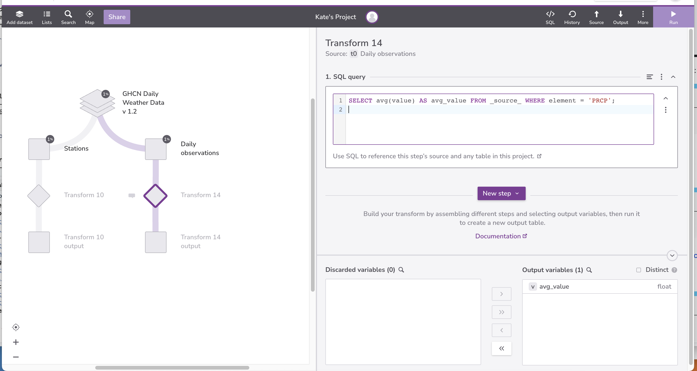
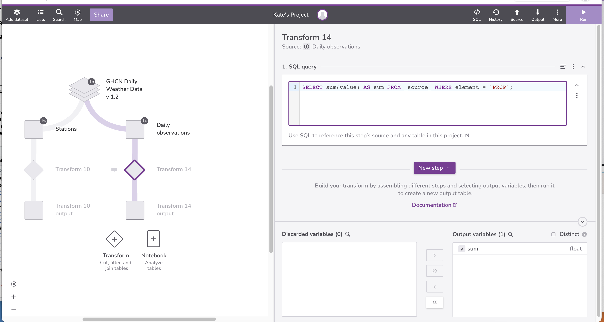
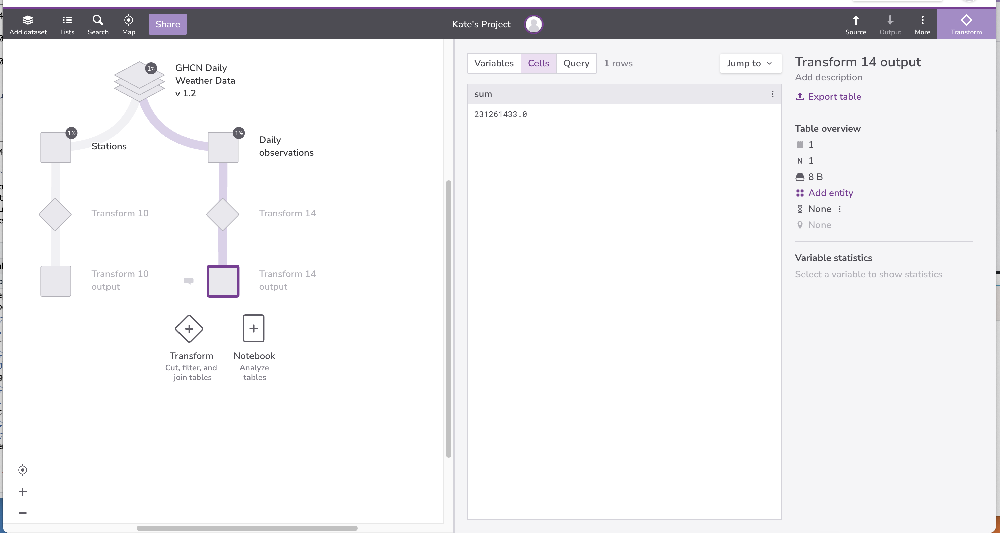
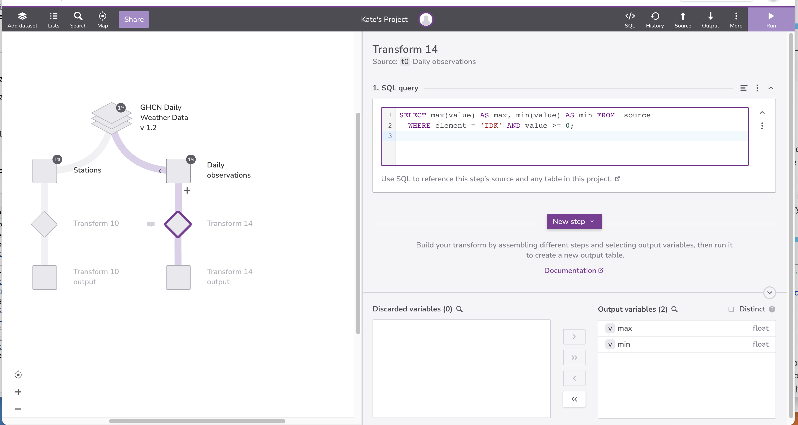
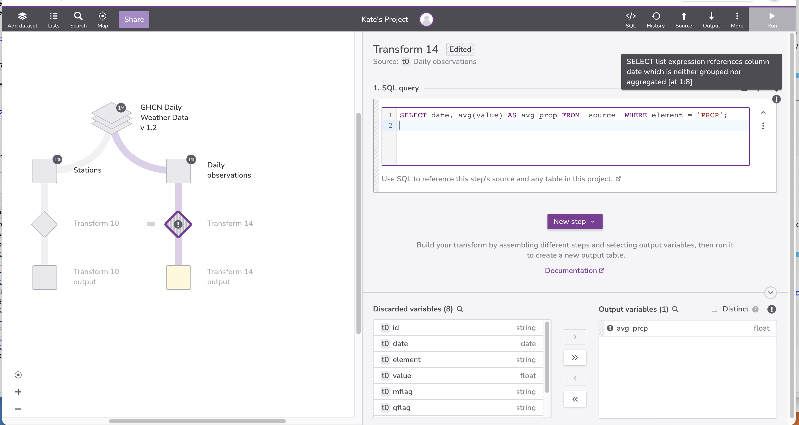
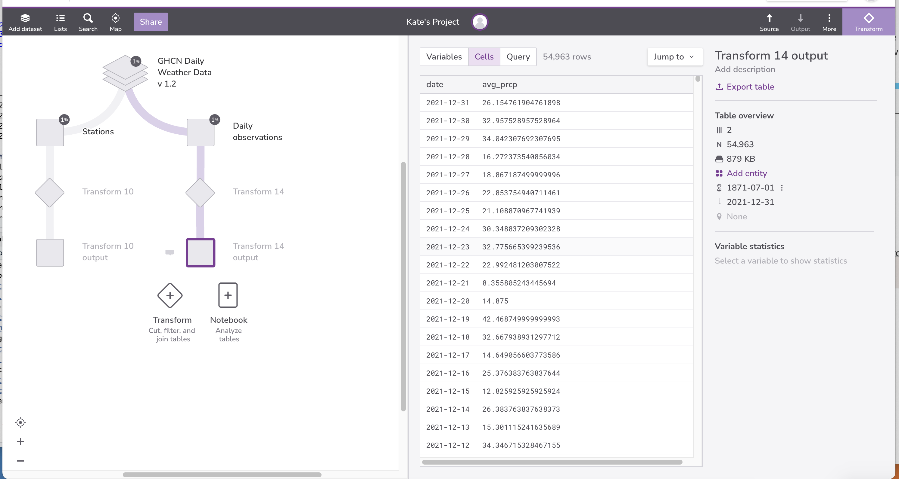
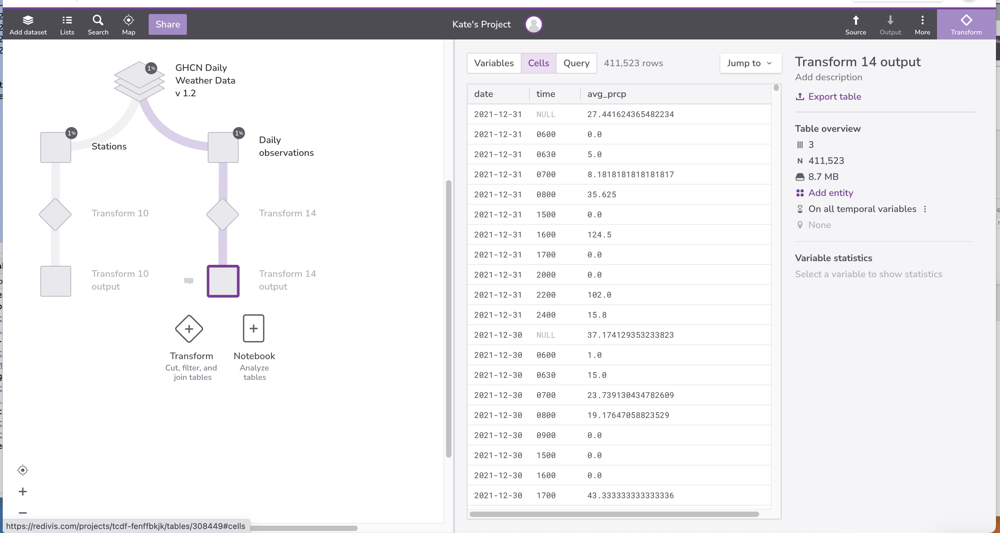
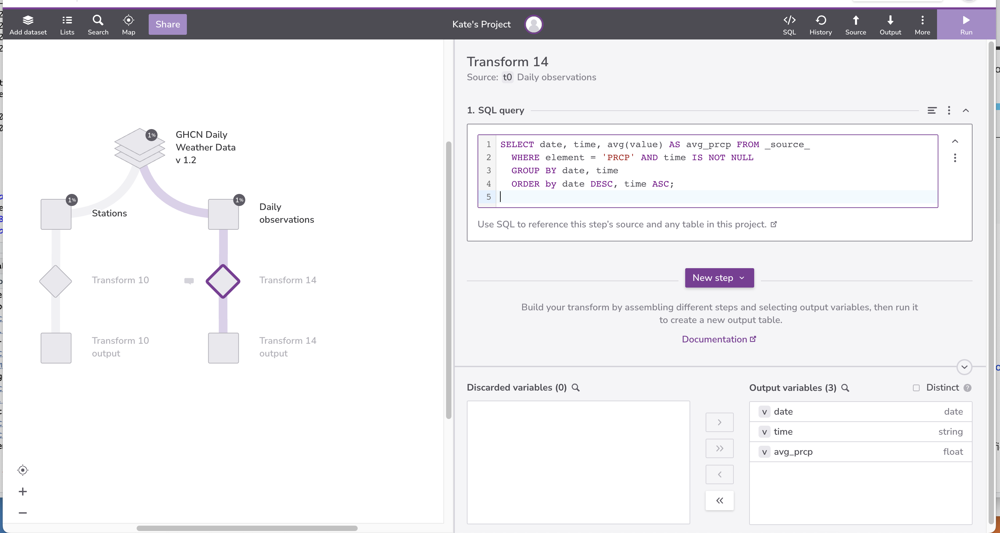

::::::::::::::::::::::::::::::::::::::: objectives

- Define aggregation and give examples of its use.
- Write queries that compute aggregated values.
- Trace the execution of a query that performs aggregation.
- Explain how missing data is handled during aggregation.

::::::::::::::::::::::::::::::::::::::::::::::::::

:::::::::::::::::::::::::::::::::::::::: questions

- How can I calculate sums, averages, and other summary values?

::::::::::::::::::::::::::::::::::::::::::::::::::

We now want to calculate ranges and averages for our data.
We know how to select all of the dates from the `Daily observations` table:

```sql
SELECT date FROM _source_;
```

but to combine them,
we must use an [aggregation function](../learners/reference.md#aggregation-function)
such as `min` or `max`.
Each of these functions takes a set of records as input,
and produces a single record as output:

```sql
SELECT min(date) AS min_date FROM _source_;
```

| min_date   | 
| ---------------- |
|  1871-07-01| 


{#id .class border=5px alt=''}

{#id .class border=5px alt=''}

```sql
SELECT max(date) AS max_date FROM _source_;

```

| max_date   | 
| ---------------- |
|  2021-12-31| 

{#id .class border=5px alt=''}

{#id .class border=5px alt=''}

`min` and `max` are just two of
the aggregation functions built into SQL.
Three others are `avg`,
`count`,
and `sum`:

```sql
SELECT avg(value) AS avg_value FROM _source_ WHERE element = 'PRCP';

```

| avg_value     | 
| ---------------- |
| 24.895614002602183 | 

{#id .class border=5px alt=''}

{#id .class border=5px alt=''}


```sql
SELECT count(element) AS count FROM _source_ WHERE element = 'PRCP';
```

| count  | 
| ---------------- |
| 9289244                | 

{#id .class border=5px alt=''}

{#id .class border=5px alt=''}

```sql
SELECT sum(value) AS sum FROM _source_ WHERE element = 'PRCP';
```

| sum     | 
| ---------------- |
| 231261433.0            | 

{#id .class border=5px alt=''}

{#id .class border=5px alt=''}


We used `count(element)` here,
but we could just as easily have counted `date`
or any other field in the table,
or even used `count(*)`,
since the function doesn't care about the values themselves,
just how many values there are.

SQL lets us do several aggregations at once.
We can,
for example,
find the range of sensible precipitation measurements:

```sql
SELECT min(value) AS min, max(value) AS max FROM _source_ 
  WHERE element = 'PRCP' AND value >= 0;
```

| min     | max | 
| ---------------- | -------------- |
| 0.0             | 22860.0         | 

{#id .class border=5px alt=''}

{#id .class border=5px alt=''}


Another important fact is that when there are no values to aggregate ---
for example, where there are no rows satisfying the `WHERE` clause ---
aggregation's result is "don't know"
rather than zero or some other arbitrary value:

```sql
SELECT max(value) AS max, min(value) AS min 
  FROM _source_ WHERE element = 'IDK' AND value >= 0;
```

| min           | max   |
| ---------------- | -------------- |
| \-null-           | \-null-         | 

{#id .class border=5px alt=''}

{#id .class border=5px alt=''}

One final important feature of aggregation functions is that
they are inconsistent with the rest of SQL in a very useful way.
If we add two values,
and one of them is null,
the result is null.
By extension,
if we use `sum` to add all the values in a set,
and any of those values are null,
the result should also be null.
It's much more useful,
though,
for aggregation functions to ignore null values
and only combine those that are non-null.
This behavior lets us write our queries as:

```sql
SELECT min(date) AS min FROM _source_;
```

| min       | 
| ---------------- |
| 1871-07-01      | 

instead of always having to filter explicitly:

```sql
SELECT min(date) AS min FROM _source_ WHERE date IS NOT NULL;
```

| min     | 
| ---------------- |
| 1871-07-01       | 

Let's say that we want to know the average precipitation by date.
If we try the following query, Redivis will throw an error:

```sql
SELECT date, avg(value) AS avg_prcp FROM _source_ WHERE element = 'PRCP';
```
because Redivis doesn't know which date to return alongside the average precipitation.

{#id .class border=5px alt=''}

There are 54,963 unique dates. It's not reasonable to write 54,963 queries of the form:

```sql
SELECT date, avg(value) AS avg_prcp FROM _source_ 
WHERE element = 'PRCP' AND date = YYYY-MM-DD;

```

What we need to do is
tell the database manager to aggregate the average precipitation for each date separately
using a `GROUP BY` clause:

```sql
SELECT date, avg(value) AS avg_prcp FROM _source_ WHERE element = 'PRCP'
  GROUP BY date
  ORDER by date DESC;

```

| date           | avg_prcp | 
| ---------------- | -------------- | 
| 2021-12-31             | 26.154761904761898              | 
| 2021-12-30             | 32.957528957528964              | 
| 2021-12-29              | 34.042307692307695            | 
| 2021-12-28              | 16.272373540856034             |  

{#id .class border=5px alt=''}
{#id .class border=5px alt=''}

`GROUP BY` does exactly what its name implies:
groups all the records with the same value for the specified field together
so that aggregation can process each batch separately.


Just as we can sort by multiple criteria at once,
we can also group by multiple criteria.
To get the average reading by scientist and quantity measured,
for example,
we just add another field to the `GROUP BY` clause:

```sql
SELECT date, time, avg(value) AS avg_prcp FROM _source_ WHERE element = 'PRCP'
  GROUP BY date, time
  ORDER by date DESC, time ASC;
```

| date          | time          | avg_prcp         |
| ---------------- | -------------- | ---------------------- |
| 2021-12-31          | \-null-              | 27.441624365482234                      | 
| 2021-12-31           | 0600           | 0.0                     |
| 2021-12-31            | 0630            | 5.0                      | 
| 2021-12-31            | 0700            | 8.1818181818181817                     | 
                | 

Note that we have added `time` to the list of fields displayed,
since the results wouldn't make much sense otherwise.

{#id .class border=5px alt=''}
{#id .class border=5px alt=''}

Let's go one step further and remove all the entries
where we don't know what time the measurement was taken:

```sql
SELECT date, time, avg(value) AS avg_prcp FROM _source_ 
  WHERE element = 'PRCP' AND time NOT NULL
  GROUP BY date, time
  ORDER by date DESC, time ASC;
```

| date          | time          | avg_prcp         |
| ---------------- | -------------- | ---------------------- | ---------------------- |
| 2021-12-31           | 0600           | 0.0                     |
| 2021-12-31            | 0630            | 5.0                      | 
| 2021-12-31            | 0700            | 8.1818181818181817                     |
| 2021-12-31            | 0800            | 35.625                     |  
| 2021-12-31            | 1500            | 0.0                     |  


{#id .class border=5px alt=''}
{#id .class border=5px alt=''}

Looking more closely,
this query:

1. selected records from the `Daily observations` table
  where the `element` field is 'PRCP' and the `time` field was not null;

2. grouped those records into 
  `date` and `time` subsets;

3. ordered those subsets first by `date`,
  and then by `time`;
  and

4. calculated the average precipitation of each subset.

:::::::::::::::::::::::::::::::::::::::  challenge

## Counting Observation Types

Using the `Daily observations` table, find out how many times each observation type occurred.

:::::::::::::::  solution

## Solution

```sql
SELECT element, count(*) as count FROM _source_ 
  GROUP by element;
  ```


{#id .class border=5px alt=''}
{#id .class border=5px alt=''}


:::::::::::::::::::::::::

::::::::::::::::::::::::::::::::::::::::::::::::::

:::::::::::::::::::::::::::::::::::::::  challenge

## Averaging with NULL

The average of a set of values is the sum of the values
divided by the number of values.
Does this mean that the `avg` function returns 2.0 or 3.0
when given the values 1.0, `null`, and 5.0?

:::::::::::::::  solution

## Solution

The answer is 3.0.
`NULL` is not a value; it is the absence of a value.
As such it is not included in the calculation.


:::::::::::::::::::::::::

::::::::::::::::::::::::::::::::::::::::::::::::::

:::::::::::::::::::::::::::::::::::::::  challenge

## Comparing Precipitation Measures and Average Precipitation

Write a query that returns the difference between
each individual precipitation measure
and the average of all the precipitation measures.


:::::::::::::::  solution

## Solution

We can accomplish this task using sub-queries.


```sql
SELECT value - (SELECT avg(value) AS avg
  FROM _source_ WHERE element='PRCP') AS difference 
  FROM _source_ WHERE element = 'PRCP';
  ```

{#id .class border=5px alt=''}
{#id .class border=5px alt=''}

:::::::::::::::::::::::::

::::::::::::::::::::::::::::::::::::::::::::::::::


:::::::::::::::::::::::::::::::::::::::: keypoints

- Use aggregation functions to combine multiple values.
- Aggregation functions ignore `null` values.
- Aggregation happens after filtering.
- Use GROUP BY to combine subsets separately.


::::::::::::::::::::::::::::::::::::::::::::::::::


