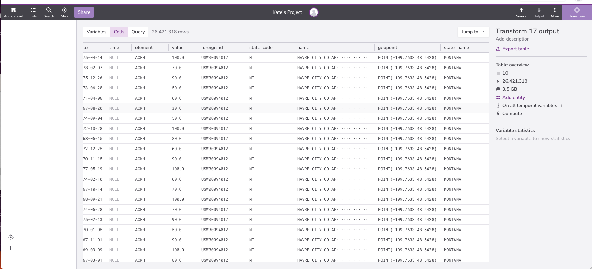

::::::::::::::::::::::::::::::::::::::: objectives

- Explain the operation of a query that joins two tables.
- Explain how to restrict the output of a query containing a join to only include meaningful combinations of values.
- Write queries that join tables on equal keys.
- Explain what primary and foreign keys are, and why they are useful.

::::::::::::::::::::::::::::::::::::::::::::::::::

:::::::::::::::::::::::::::::::::::::::: questions

- How can I combine data from multiple tables?

::::::::::::::::::::::::::::::::::::::::::::::::::

In order to submit our data to a web site
that aggregates historical meteorological data,
we need to format it as a table with the columns `date`, `time`, `name`, `state`, `geopoint`, `element` and `value`.


However,
`name`, `state` and `geopoint` are in the `Stations` table,
while `date`, `time`, `element` and `value` are in the `Daily observations` table.
We need to combine these tables somehow.

The SQL command to do this is `JOIN`. 

`JOIN` creates
the [cross product](../learners/reference.md#cross-product)
of two tables. 

Let's look at the skeleton of a `JOIN` query:

```sql
SELECT
  [variables]
FROM
  [table 1]
JOIN 
  [table 2] 
ON
  [common field]
```

We want to join `Daily observations` (`_source_`) with `Stations` (`stanfordphs.ghcn_daily_weather_data:mg94:v1_2:sample.stations:w0e9`). For clarity, we give our tables the aliases `t0` and `t1`.

```sql
SELECT
  [variables]
FROM
  _source_ AS t0
JOIN 
  `stanfordphs.ghcn_daily_weather_data:mg94:v1_2:sample.stations:w0e9` AS t1  
ON
  [common field]
```

Next, we must choose field(s) on which to join our two tables. We will join our tables `ON` the `id` field. 


```sql
SELECT
  [variables]
FROM
  _source_ AS t0
JOIN 
  `stanfordphs.ghcn_daily_weather_data:mg94:v1_2:sample.stations:w0e9` AS t1  
ON
  t0.id = t1.id
```

Finally, we select the variables we would like in our output. Notice that we used `Table.field` to specify field names in the output of the join. We do this because tables can have fields with the same name, and we need to be specific which ones we’re talking about. We have also given our selected variables more human-friendly names using the `AS` operator.

```sql
SELECT
  t0.id AS id,
  t0.date AS date,
  t0.time AS time,
  t0.element AS element,
  t0.value AS value,
  t1.state AS state,
  t1.name AS name,
  t1.geopoint AS geopoint
FROM
  _source_ AS t0
JOIN 
  `stanfordphs.ghcn_daily_weather_data:mg94:v1_2:sample.stations:w0e9` AS t1  
ON
  t0.id = t1.id
```

Here is what our query and output look like in Redivis:

{#id .class border=5px alt=''}
{#id .class border=5px alt=''}

If joining two tables is good,
joining many tables must be better.
In fact,
we can join any number of tables
simply by adding more `JOIN` clauses to our query,
and more `ON` tests to filter out combinations of records
that don't make sense:

```sql
SELECT
  t0.id AS id,
  t0.date AS date,
  t0.time AS time,
  t0.element AS element,
  t0.value AS value,
  t1.id AS foreign_id,
  t1.state AS state_code,
  t1.name AS name,
  t1.geopoint AS geopoint,
  t2.name AS state_name
FROM
  _source_ AS t0
JOIN 
  `stanfordphs.ghcn_daily_weather_data:mg94:v1_2:sample.stations:w0e9` AS t1  
ON
  t0.id = t1.id
LEFT JOIN
  `stanfordphs.ghcn_daily_weather_data:mg94:v1_2.states:akcp` as t2
ON
  t1.state = t2.code
```

{#id .class border=5px alt=''}
{#id .class border=5px alt=''}


In the above query, we join `Daily observations` with `Stations` with `States`.
Our output contains some (but not all) of the variables included in each source table.
Notice that for the second `JOIN`, we use `LEFT JOIN`. By doing this, we are asking the database:

1. Join on `Stations.state` = `States.code` (these should both be two-letter abbreviations for state name)

2. If a value of `Stations.state` does not have any matches among `States.code`, 
return the value `Stations.state` and `States.code` as `null`.

{#id .class border=5px alt=''}

:::::::::::::::::::::::::::::::::::::::::  callout

## Types of JOINS

There are several variations of `JOIN`. For more information, check out the [W3 Schools SQL Tutorial](https://www.w3schools.com/sql/sql_join.asp). Note that a plain `JOIN` is equivalent to `INNER JOIN`. A good visual explanation of joins can be [found here][joinref]

[outer]: https://en.wikipedia.org/wiki/Join_%28SQL%29#Outer_join
[rowid]: https://www.sqlite.org/lang_createtable.html#rowid
[joinref]: https://sql-joins.leopard.in.ua/

::::::::::::::::::::::::::::::::::::::::::::::::::


We can tell which records from `Daily observations`, `Stations` and `States`
correspond with each other
because those tables contain
[primary keys](../learners/reference.md#primary-key)
and [foreign keys](../learners/reference.md#foreign-key).
A primary key is a value,
or combination of values,
that uniquely identifies each record in a table.
A foreign key is a value (or combination of values) from one table
that identifies a unique record in another table.
Another way of saying this is that
a foreign key is the primary key of one table
that appears in some other table.


Most database designers believe that
every table should have a well-defined primary key.
They also believe that this key should be separate from the data itself,
so that if we ever need to change the data,
we only need to make one change in one place.


:::::::::::::::::::::::::::::::::::::::  challenge

## Expanding on the Inventory 

The `Inventory` table gives us information about observations at given stations.
Write a query that returns this information, as well as the name and state of the station.

:::::::::::::::  solution

## Solution

```sql
SELECT
  t0.id,
  t0.latitude,
  t0.longitude,
  t0.element,
  t0.firstyear,
  t0.lastyear,
  t1.name,
  t1.state
FROM
  _source_ AS t0
JOIN 
  `stanfordphs.ghcn_daily_weather_data:mg94:v1_2:sample.stations:w0e9` AS t1  
ON
  t0.id = t1.id
```
{#id .class border=5px alt=''}
{#id .class border=5px alt=''}


:::::::::::::::::::::::::

::::::::::::::::::::::::::::::::::::::::::::::::::


:::::::::::::::::::::::::::::::::::::::: keypoints

- Use JOIN to combine data from two tables.
- Use table.field notation to refer to fields when doing joins.
- Every fact should be represented in a database exactly once.
- A join produces all combinations of records from one table with records from another.
- A primary key is a field (or set of fields) whose values uniquely identify the records in a table.
- A foreign key is a field (or set of fields) in one table whose values are a primary key in another table.
- We can eliminate meaningless combinations of records by matching primary keys and foreign keys between tables.
- The most common join condition is matching keys.

::::::::::::::::::::::::::::::::::::::::::::::::::


