::::::::::::::::::::::::::::::::::::::: objectives


- Write a query to select all values for specific fields from a single table.

::::::::::::::::::::::::::::::::::::::::::::::::::

:::::::::::::::::::::::::::::::::::::::: questions

- How can I get data from a database?

::::::::::::::::::::::::::::::::::::::::::::::::::

A [relational database](../learners/reference.md#relational-database)
is a way to store and manipulate information.
Databases are arranged as [tables](../learners/reference.md#table).
Each table has columns (also known as [fields](../learners/reference.md#fields)) that describe the data,
and rows (also known as [records](../learners/reference.md#record)) which contain the data.

When we are using a spreadsheet,
we put formulas into cells to calculate new values based on old ones.
When we are using a database,
we send commands
(usually called [queries](../learners/reference.md#query))
to a [database manager](../learners/reference.md#database-manager):
a program that manipulates the database for us.
The database manager does whatever lookups and calculations the query specifies,
returning the results in a tabular form
that we can then use as a starting point for further queries.

Queries are written in a language called [SQL](../learners/reference.md#sql),
which stands for "Structured Query Language".
SQL provides hundreds of different ways to analyze and recombine data.
We will only look at a handful of queries,
but that handful accounts for most of what scientists do.


Let's take a look at the tables of the database we will use in our examples.

In your Redivis project, select the database node.

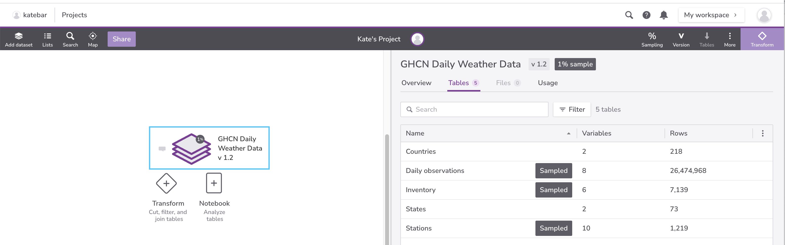{#id .class border=5px alt=''}

On the right-hand side of the page, we will see that there are 5 tables associated with this database:

- `Countries`
- `Daily observations`
- `Inventory`
- `States`
- `Stations`

Let's select `Stations`.

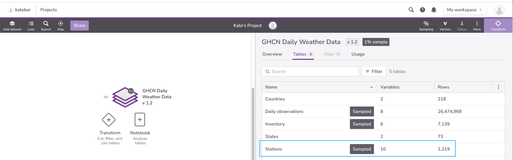{#id .class border=5px alt=''}

The `Stations` table includes information about each station. The **Variables** tab shows us 10 variables and their types. 


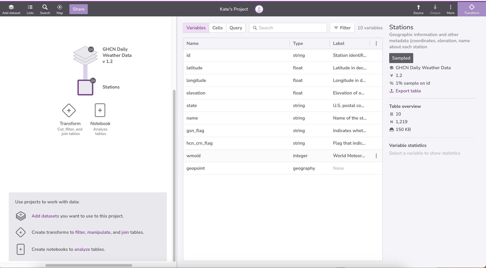{#id .class border=5px alt=''}


We can select specific variables for summary statistics about that variable. Let's select `state`. Under **Variable statistics** we can learn more about this variable, such as the frequency with which certain values occur and the number of distinct (unique) values. Note that the `state` variable is 100% non-null. We’ll return to these missing values [later](05-null.md).

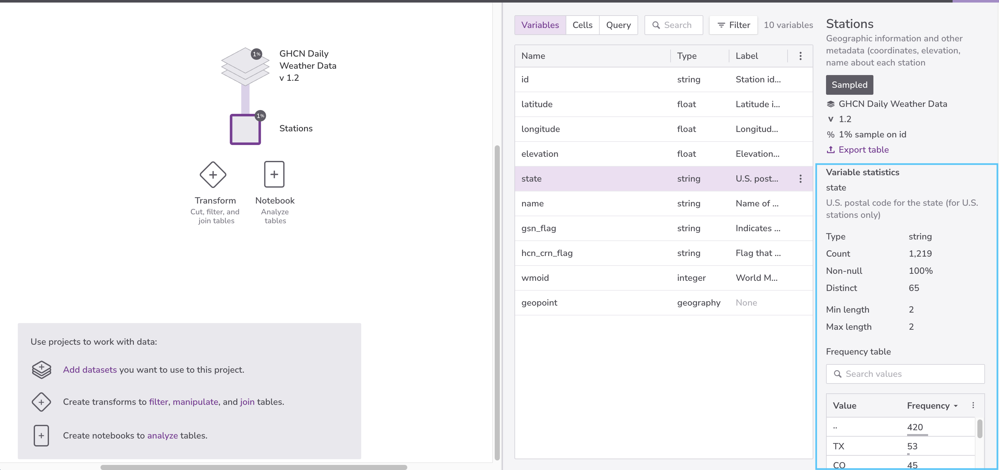{#id .class border=5px alt=''}

Finally, we can select the **Cells** tab to preview records.

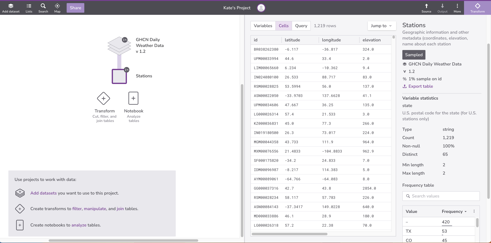{#id .class border=5px alt=''}

Let's write an SQL query that displays station names and what state the stations are located in.

Select the **Transform** node. Transform nodes are where we will write our SQL queries.

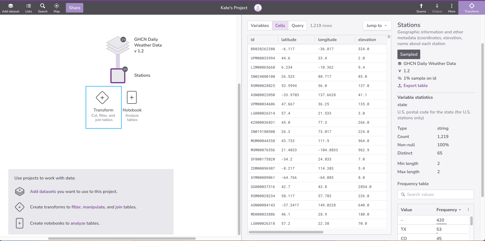{#id .class border=5px alt=''}

Select **New step** and then **SQL query**. A query editor will display on the right side of the page; it will be populated with a default query.

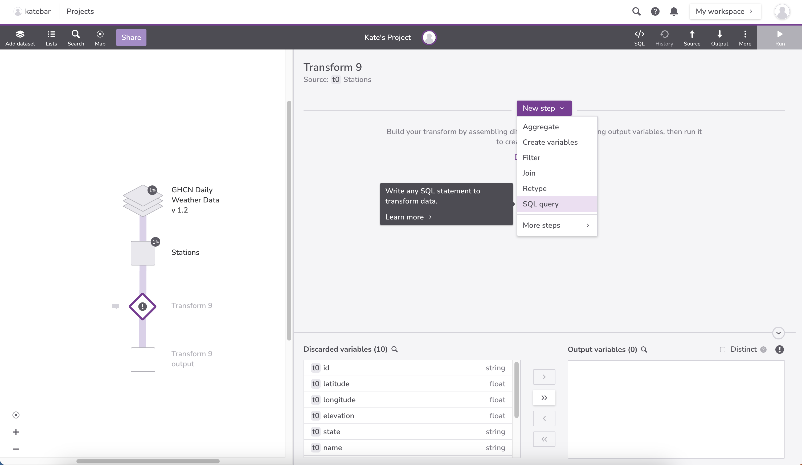{#id .class border=5px alt=''}

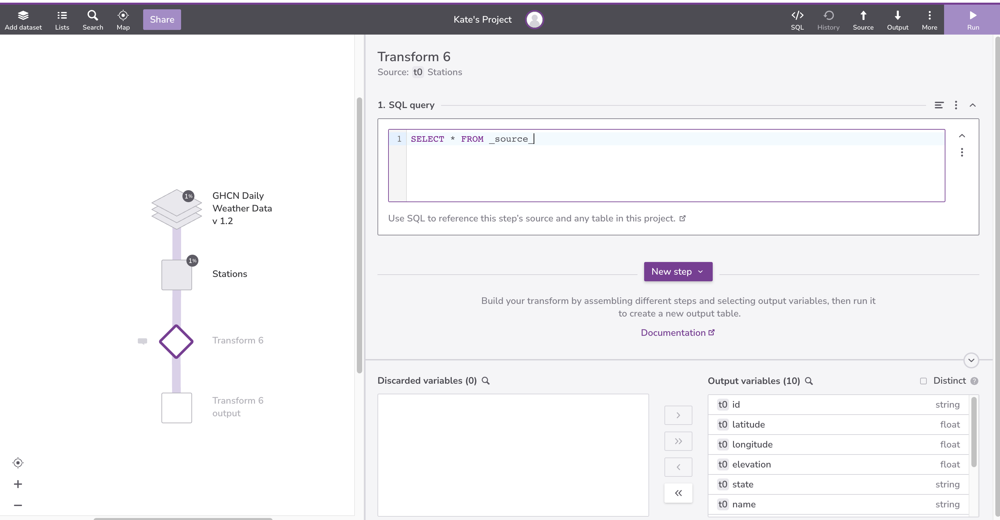{#id .class border=5px alt=''}

Now we will write a SQL `SELECT` command,
giving it the names of the columns we want and the table we want them from.
Our query will look like this:

```sql
SELECT state, name FROM _source_;
```

Select **Run** in the upper right-hand corner. Then select the output table node. Here we can see the results of the query.

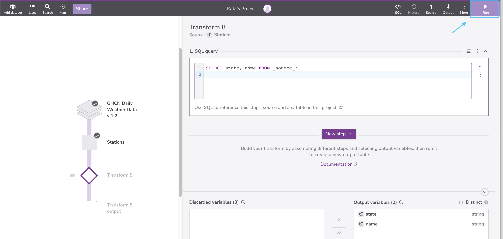{#id .class border=5px alt=''}


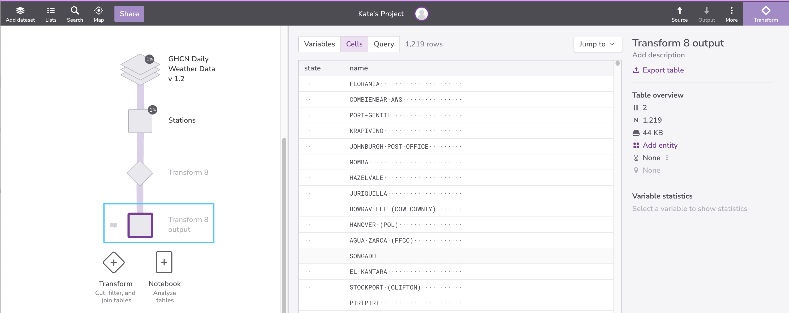{#id .class border=5px alt=''}


:::: callout

#### Table Name

In the Redivis SQL query editor, the table we are working with is given the alias  `_source_`.


::::::::::::

:::: callout

#### Semi-Colon

Generally, database managers expect a semicolon at the end of a query. This tells the database manager that the query is complete and ready to run. In Redivis, semicolons aren't required at the end of a query, but it's a good practice to use them.


::::::::::::

We have written our commands in upper case and the names for the table and columns
in lower case,
but we don't have to:
as the example below shows,
SQL is [case insensitive](../learners/reference.md#case-insensitive). 

```sql
SeLeCt StAtE,nAmE FrOm _source_
```

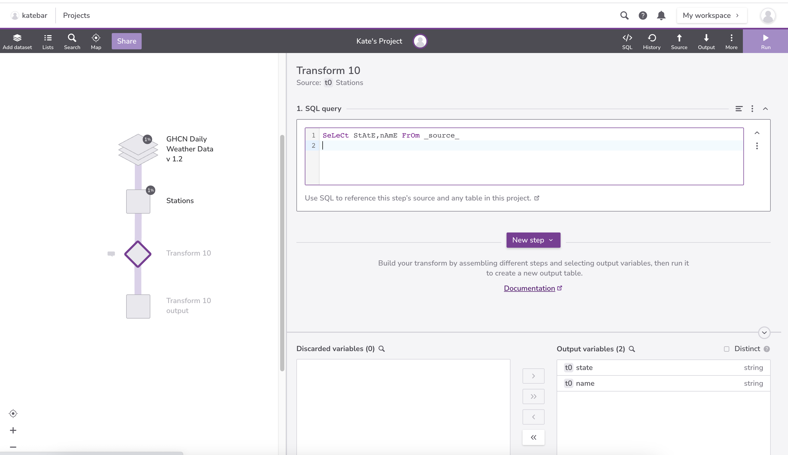{#id .class border=5px alt=''}


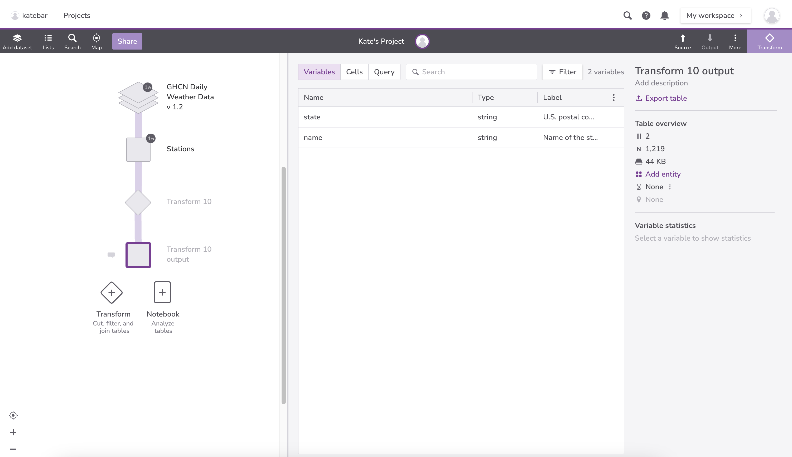{#id .class border=5px alt=''}


You can use SQL's case insensitivity
to distinguish between different parts of an SQL statement.
In this lesson, we use the convention of using UPPER CASE for SQL keywords
(such as `SELECT` and `FROM`), and lower case for field names.
Whatever casing
convention you choose, please be consistent: complex queries are hard
enough to read without the extra cognitive load of random
capitalization.


Now, going back to our query,
it's important to understand that
the rows and columns in a database table aren't actually stored in any particular order.
They will always be *displayed* in some order,
but we can control that in various ways.
For example,
we could swap the columns in the output by writing our query as:

```sql
SELECT name,state FROM _source_
```

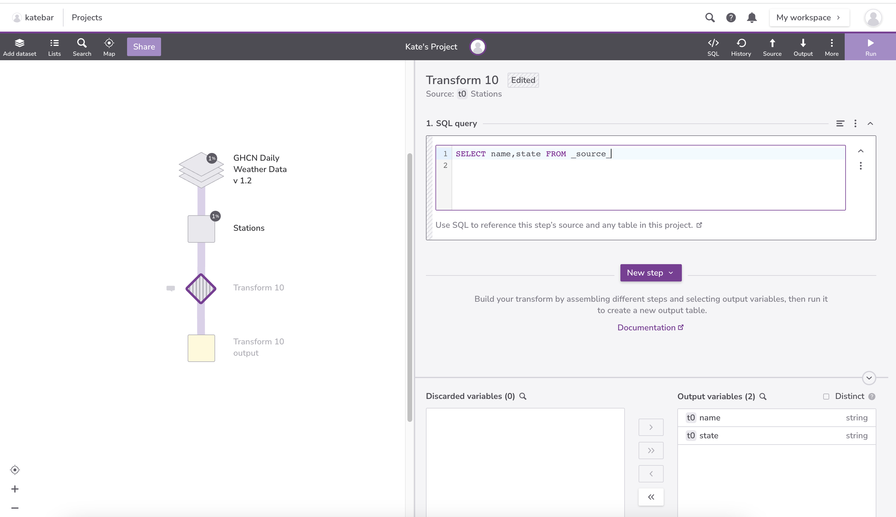{#id .class border=5px alt=''}


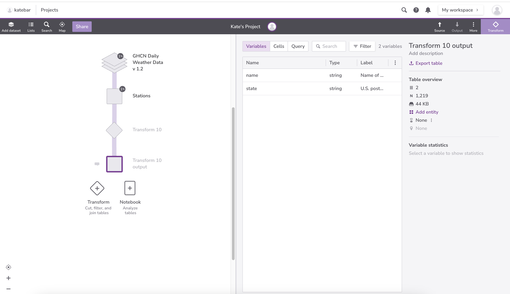{#id .class border=5px alt=''}


As a shortcut,
we can select all of the columns in a table using `*`:

```sql
SELECT * FROM _source_
```

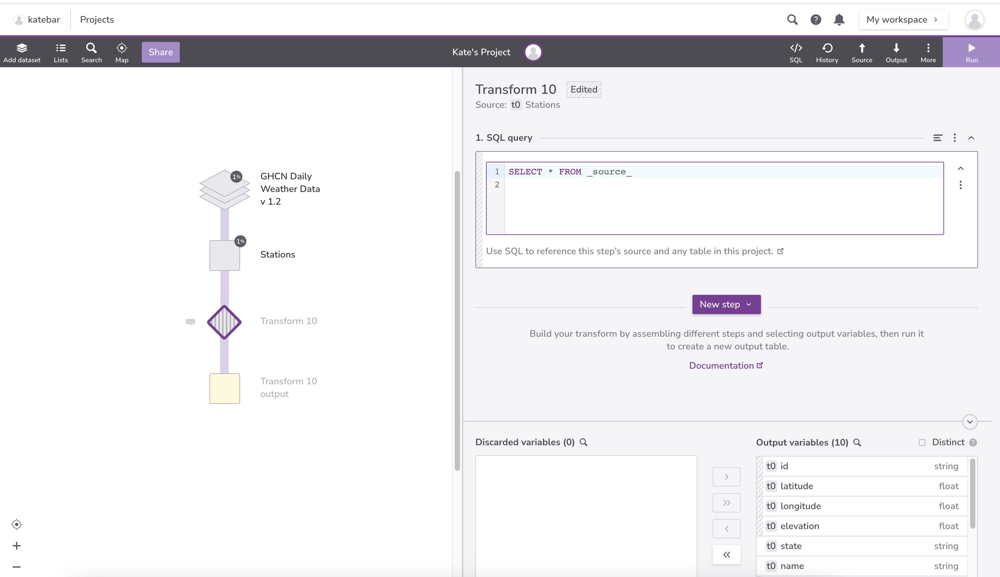{#id .class border=5px alt=''}


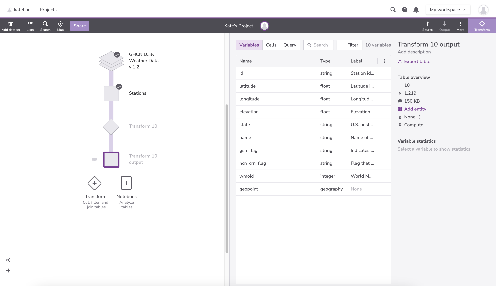{#id .class border=5px alt=''}

:::::::::::::::::::::::::::::::::::::::  challenge

## Integers vs. Floats

In the `Stations` table, there are two numeric data types: integers and floats. Which variables are integers? Which are floats? What is the difference between integers and floats?

:::::::::::::::  solution

## Solution

Integers:

- `wmoid`

Floats:

- `latitude`
- `longitude`
- `elevation`

Integers are whole numbers. Floats are numbers with decimal places.

:::::::::::::::::::::::::

::::::::::::::::::::::::::::::::::::::::::::::::::

:::::::::::::::::::::::::::::::::::::::  challenge

## Selecting Geopoints

Write a query that selects only the `geopoint` column from the `Stations` table.

:::::::::::::::  solution

## Solution

```sql
SELECT geopoint FROM _source_
```

:::::::::::::::::::::::::

::::::::::::::::::::::::::::::::::::::::::::::::::

:::::::::::::::::::::::::::::::::::::::  challenge

## Query Style

Many people format queries as:

```sql
SELECT personal, family FROM person;
```

or as:

```sql
select Personal, Family from PERSON;
```

What style do you find easiest to read, and why?


::::::::::::::::::::::::::::::::::::::::::::::::::

:::::::::::::::::::::::::::::::::::::::: keypoints

- A relational database stores information in tables, each of which has a fixed set of columns and a variable number of records.
- A database manager is a program that manipulates information stored in a database.
- We write queries in a specialized language called SQL to extract information from databases.
- Use SELECT... FROM... to get values from a database table.
- SQL is case-insensitive (but data is case-sensitive).

::::::::::::::::::::::::::::::::::::::::::::::::::


