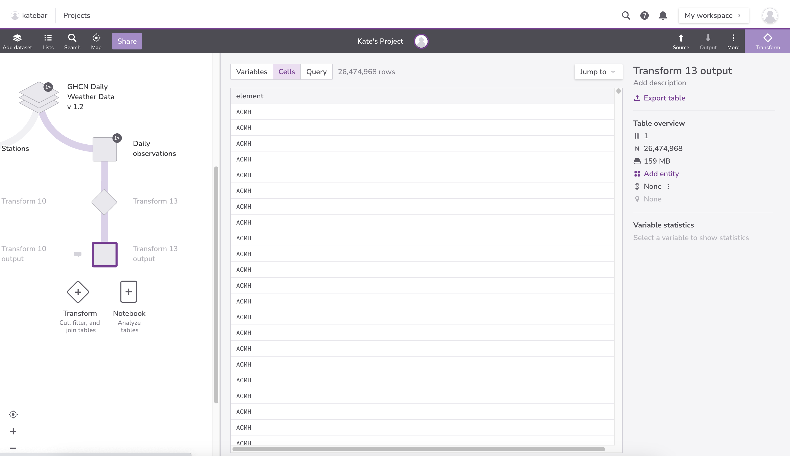
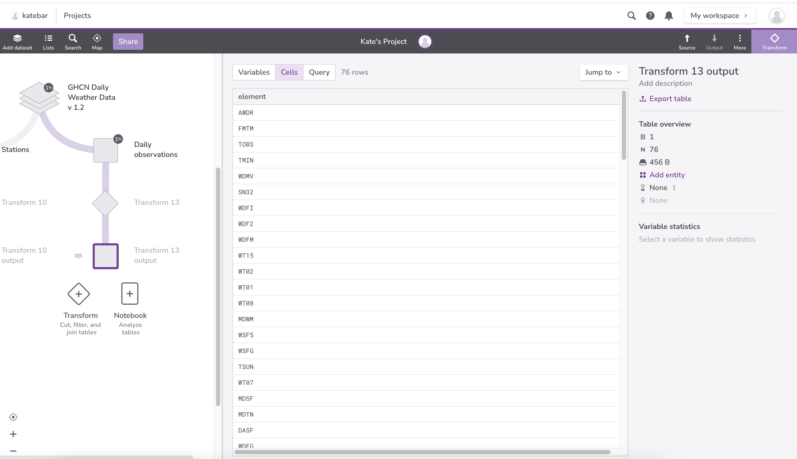
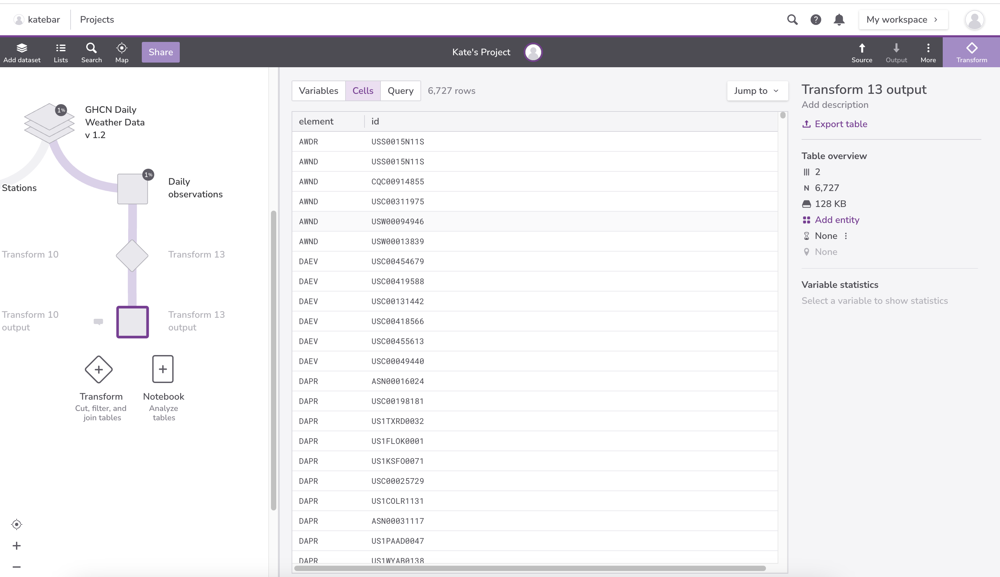
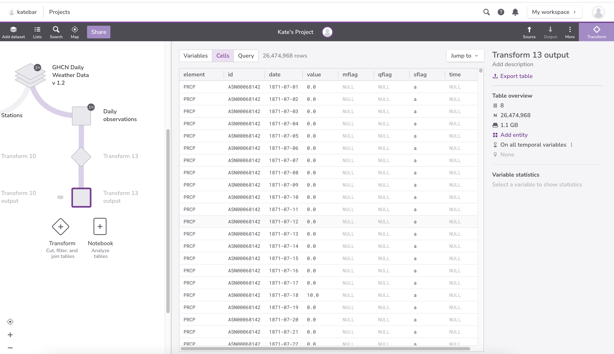
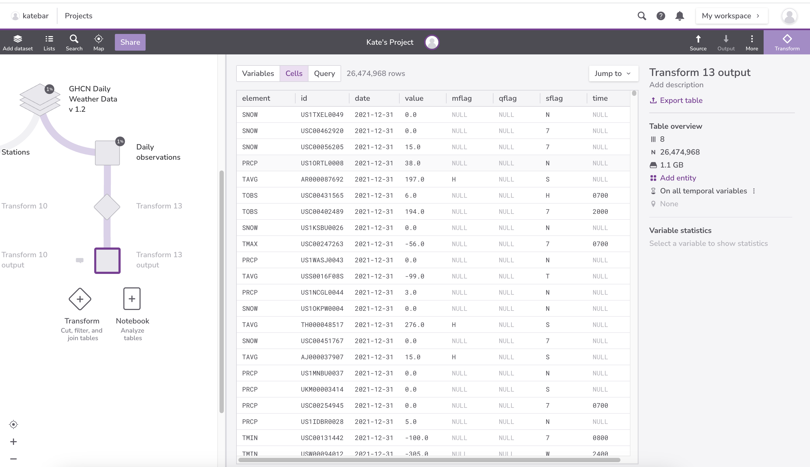
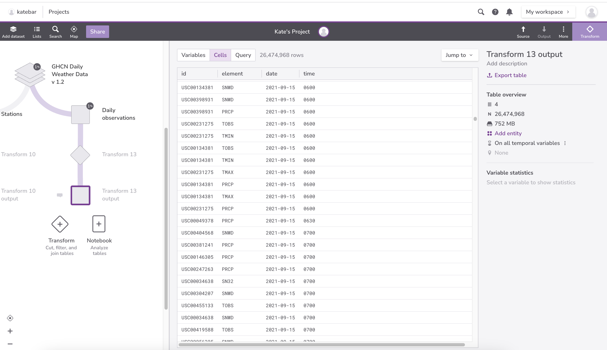
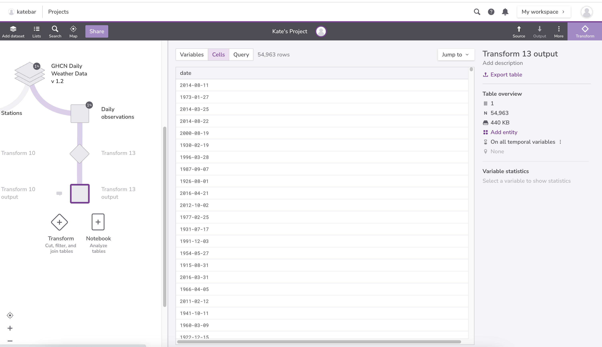
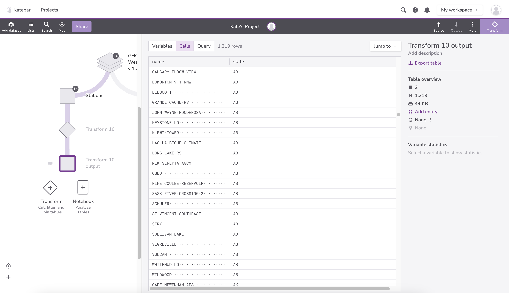

::::::::::::::::::::::::::::::::::::::: objectives

- Write queries that display results in a particular order.
- Write queries that eliminate duplicate values from data.

::::::::::::::::::::::::::::::::::::::::::::::::::

:::::::::::::::::::::::::::::::::::::::: questions

- How can I sort a query's results?
- How can I remove duplicate values from a query's results?

::::::::::::::::::::::::::::::::::::::::::::::::::

In beginning our examination of the GHCN Daily Weather Data, we want to know:

- what kind of elements (observation types) were taken at each station;
- when did these observations occur;

To determine which kinds of observations were taken,
we can examine the `Daily observations` table.
Data is often redundant,
so queries often return redundant information.
For example,
if we select the observation types that have been measured
from the `Daily observations` table,
we get this:

```sql
SELECT element FROM _source_;
```

{#id .class border=5px alt=''}


{#id .class border=5px alt=''}


This result makes it difficult to see all of the different types of
`elements` in the `Daily observations` table.  We can eliminate the redundant output to
make the result more readable by adding the `DISTINCT` keyword to our
query:

```sql
SELECT DISTINCT element FROM _source_;
```

{#id .class border=5px alt=''}


{#id .class border=5px alt=''}


If we want to determine the stations (represented by `id`) at which different observation types
were recorded,
we can use the `DISTINCT` keyword on multiple columns.
If we select more than one column,
distinct *sets* of values are returned
(in this case *pairs*, because we are selecting two columns):

```sql
SELECT DISTINCT id, element FROM  _source_;
```

{#id .class border=5px alt=''}


{#id .class border=5px alt=''}


Our next task is to identify when weather observations occurred. As we mentioned earlier,
database records are not stored in any particular order.
This means that query results aren't necessarily sorted,
and even if they are,
we often want to sort them in a different way,
e.g., by date.
We can do this in SQL by adding an `ORDER BY` clause to our query:

```sql
SELECT * FROM _source_ ORDER BY date;
```

{#id .class border=5px alt=''}


{#id .class border=5px alt=''}


By default, when we use `ORDER BY`,
results are sorted in ascending order of the column we specify
(i.e.,
from least to greatest).

:::::::::::::::::::::::::::::::::::::::::  callout

## A note on ordering

While it may look that the records are consistent every time we ask for them in this lesson, that is because no one has changed or modified any of the data so far. Remember to use `ORDER BY` if you want the rows returned to have any sort of consistent or predictable order.


::::::::::::::::::::::::::::::::::::::::::::::::::

:::::::::::::::::::::::::::::::::::::::::  callout

## Date Types

Most database managers have a special data type for dates.
In fact, many have two:
one for dates,
such as "May 31, 1971",
and one for durations,
such as "31 days".
Redivis stores [Dates](https://docs.redivis.com/reference/datasets/tables/variables#date)
and [DateTimes](https://docs.redivis.com/reference/datasets/tables/variables#datetime). 
The former is formatted as 'YYYY-[M]M-[D]D':

- YYYY: Four digit year
- [M]M: One or two digit month
- [D]D: One or two digit day

The latter is formatted as 'YYYY-[M]M-[D]D[( |T)[H]H:[M]M:[S]S[.DDDDDD]]':

- YYYY: Four digit year
- [M]M: One or two digit month
- [D]D: One or two digit day
- ( |T): A space or a Tseparator
- [H]H: One or two digit hour (valid values from 00 to 23)
- [M]M: One or two digit minutes (valid values from 00 to 59)
- [S]S: One or two digit seconds (valid values from 00 to 59)
- [.DDDDDD]\: Up to six fractional digits (i.e. up to microsecond precision)

::::::::::::::::::::::::::::::::::::::::::::::::::

We can sort in the opposite order using `DESC` (for "descending"):


```sql
SELECT * FROM _source_ ORDER BY date DESC;
```


{#id .class border=5px alt=''}


{#id .class border=5px alt=''}


(And if we want to make it clear that we're sorting in ascending order,
we can use `ASC` instead of `DESC`.)

If we want a more complete picture of when weather observations took place, we can sort on several fields at once.
This query sorts results first in descending order by `date`,
and then in ascending order by `time`:

```sql
SELECT id, element, date, time FROM _source_ ORDER BY date DESC, time ASC;
```

{#id .class border=5px alt=''}


{#id .class border=5px alt=''}


:::::::::::::::::::::::::::::::::::::::  challenge

## Finding Distinct Dates

Write a query that selects distinct dates from the `Daily observations` table.

:::::::::::::::  solution

## Solution

```sql
SELECT DISTINCT date FROM _source_;
```

{#id .class border=5px alt=''}


{#id .class border=5px alt=''}


:::::::::::::::::::::::::

::::::::::::::::::::::::::::::::::::::::::::::::::

:::::::::::::::::::::::::::::::::::::::  challenge

## Displaying Station Names and Locations

Using the `Stations` table, write a query that displays the names of stations and the states where they are located. The output should be sorted alphabetically first by state, and then by name. 

:::::::::::::::  solution

## Solution

```sql
SELECT state, name FROM _source_ ORDER BY state ASC, name ASC;
```

{#id .class border=5px alt=''}


{#id .class border=5px alt=''}

:::::::::::::::::::::::::

::::::::::::::::::::::::::::::::::::::::::::::::::

:::::::::::::::::::::::::::::::::::::::: keypoints

- The records in a database table are not intrinsically ordered: if we want to display them in some order, we must specify that explicitly with ORDER BY.
- The values in a database are not guaranteed to be unique: if we want to eliminate duplicates, we must specify that explicitly as well using DISTINCT.

::::::::::::::::::::::::::::::::::::::::::::::::::


