::::::::::::::::::::::::::::::::::::::: objectives

- Write queries that select records that satisfy user-specified conditions.
- Explain the order in which the clauses in a query are executed.

::::::::::::::::::::::::::::::::::::::::::::::::::

:::::::::::::::::::::::::::::::::::::::: questions

- How can I select subsets of data?

::::::::::::::::::::::::::::::::::::::::::::::::::

One of the most powerful features of a database is
the ability to [filter](../learners/reference.md#filter) data,
i.e.,
to select only those records that match certain criteria.
For example,
suppose we want to see all of the stations in Texas.
We can select these records from the `Stations` table
by using a `WHERE` clause in our query:

```sql
SELECT * FROM _source_ WHERE state = 'TX';
```

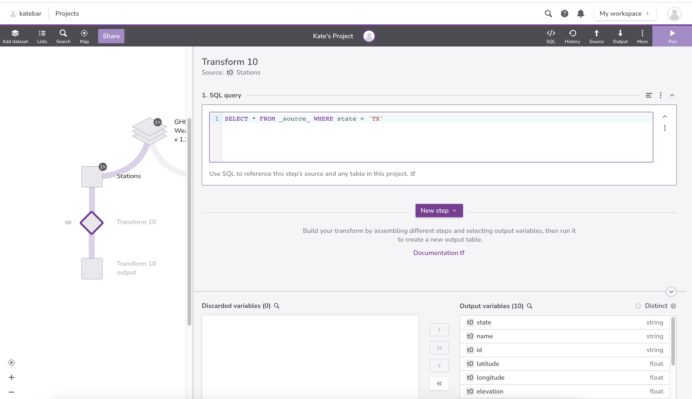{#id .class border=5px alt=''}


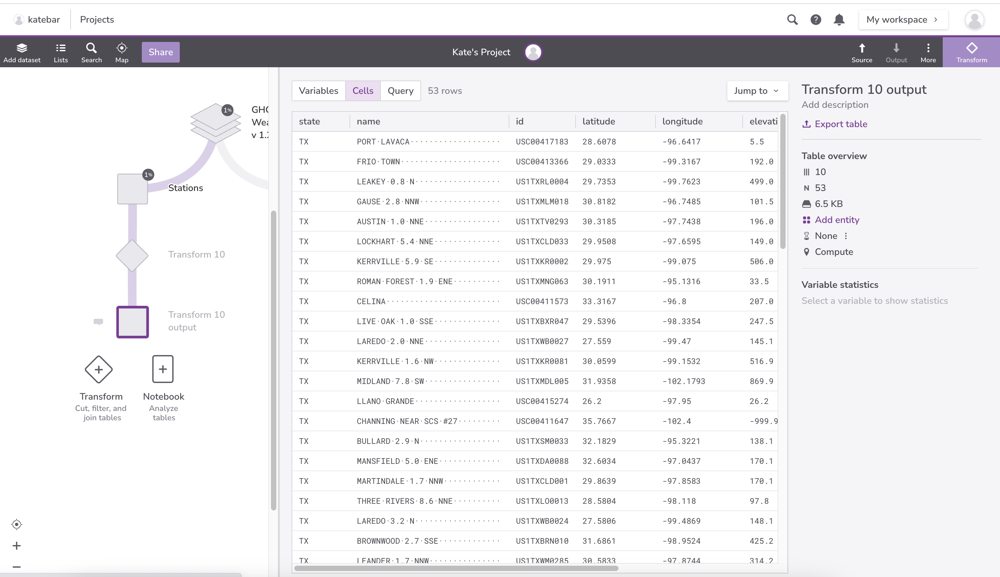{#id .class border=5px alt=''}

The database manager executes this query in two stages.
First,
it checks at each row in the `Station` table
to see which ones satisfy the `WHERE`.
It then uses the column names following the `SELECT` keyword
to determine which columns to display.

This processing order means that
we can filter records using `WHERE`
based on values in columns that aren't then displayed:

```sql
SELECT id FROM _source_ WHERE state = 'TX';
```

{#id .class border=5px alt=''}


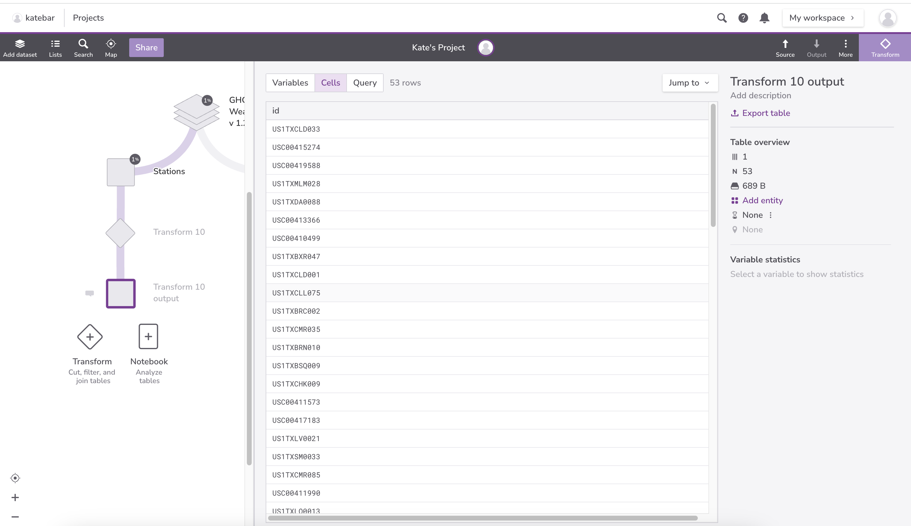{#id .class border=5px alt=''}


We can use many other Boolean operators to filter our data.
For example,
we can ask for all information from the stations at elevations less than 50 meters:

```sql
SELECT * FROM _source_  WHERE state = 'TX' AND elevation < 50;
```

{#id .class border=5px alt=''}


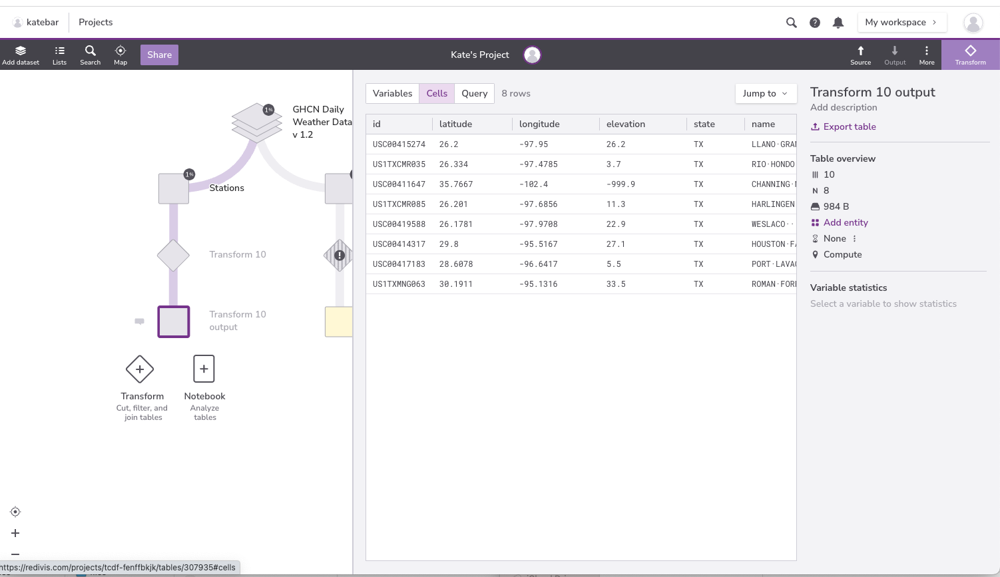{#id .class border=5px alt=''}


If we want to find stations in either Texas or Oklahoma,
we can combine the tests on their names using `OR`:

```sql
SELECT * FROM _source_  WHERE state = 'TX' OR state = 'OK';

```

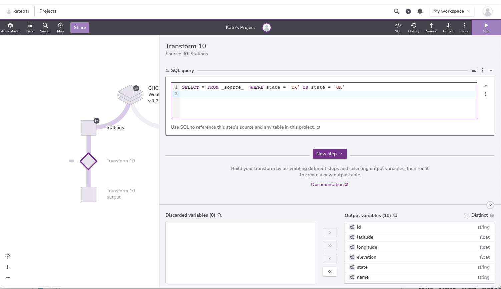{#id .class border=5px alt=''}


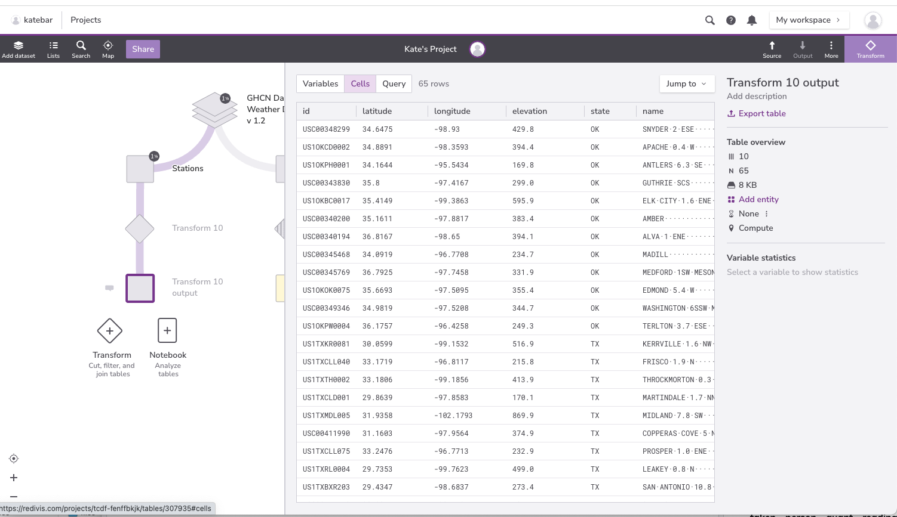{#id .class border=5px alt=''}


Alternatively,
we can use `IN` to see if a value is in a specific set:

```sql
SELECT * FROM _source_  WHERE state IN ('TX', 'OK');

```
{#id .class border=5px alt=''}


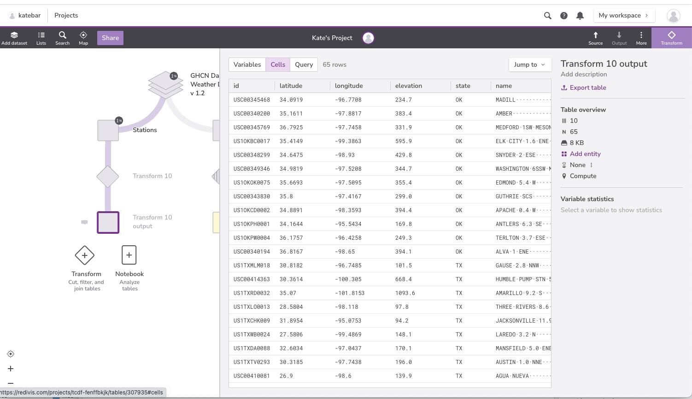{#id .class border=5px alt=''}


We can combine `AND` with `OR`,
but we need to be careful about which operator is executed first.
If we *don't* use parentheses,
we get this:

```sql
SELECT * FROM _source_ WHERE elevation < 50 AND state = 'TX' OR state = 'OK';

```

which is stations from Texas at less than 50 meters elevation,
and *any* stations from Oklahoma.

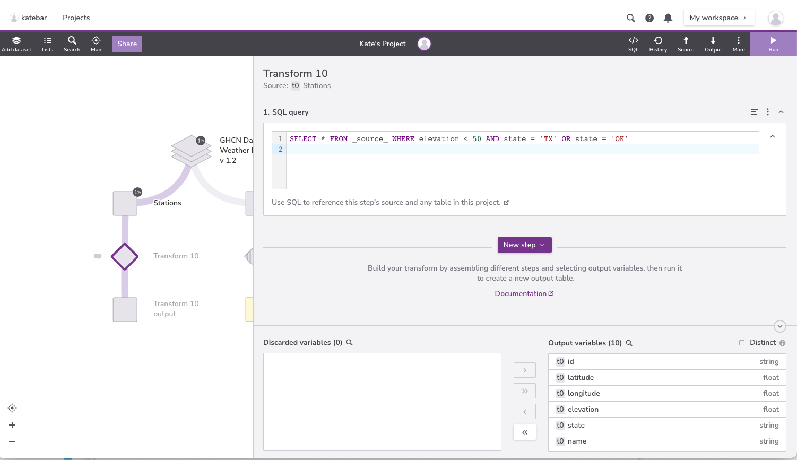{#id .class border=5px alt=''}


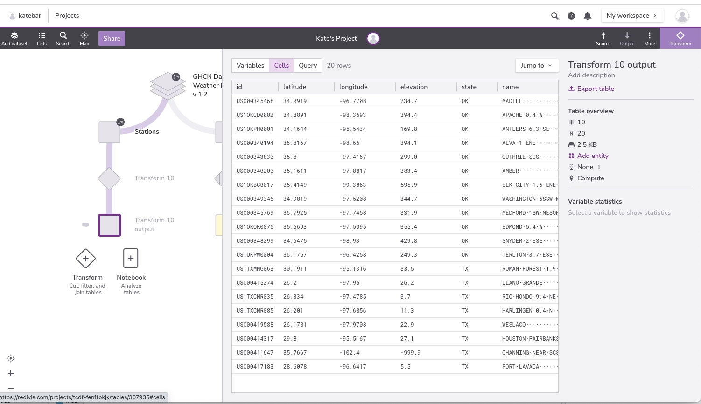{#id .class border=5px alt=''}


We probably want this instead:

```sql
SELECT * FROM _source_ WHERE elevation < 50 AND (state = 'TX' OR state = 'OK');

```

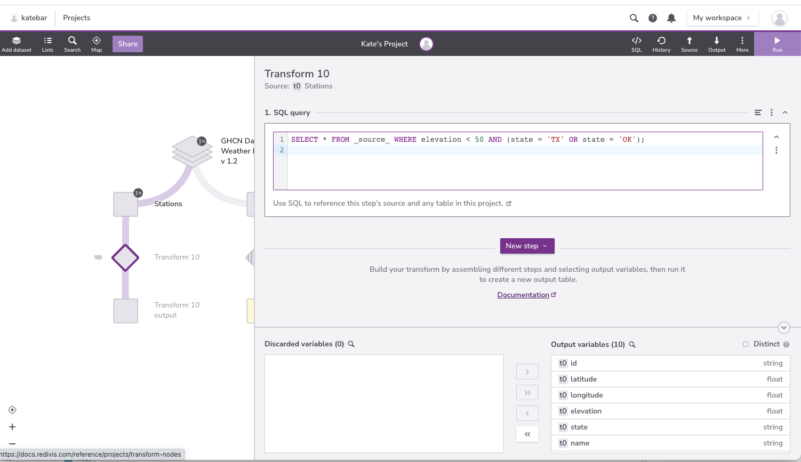{#id .class border=5px alt=''}


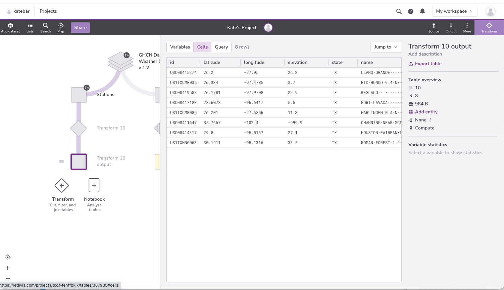{#id .class border=5px alt=''}

We can also filter by partial matches.  For example, if we want to
know something just about the station ids beginning with "MD" we can
use the `LIKE` keyword.  The percent symbol acts as a
[wildcard](../learners/reference.md#wildcard), matching any characters in that
place.  It can be used at the beginning, middle, or end of the string:

```sql
SELECT * FROM _source_ WHERE id LIKE 'MD%';
```

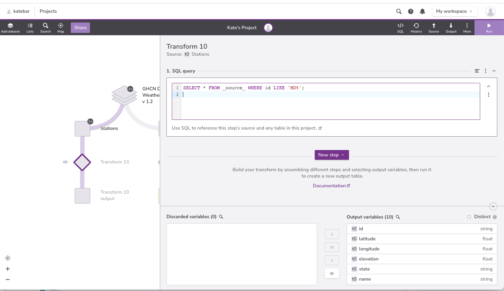{#id .class border=5px alt=''}


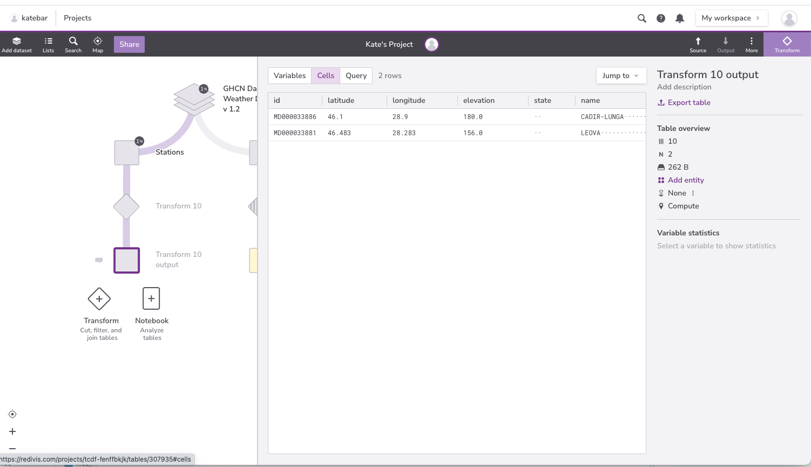{#id .class border=5px alt=''}


Finally,
we can use `DISTINCT` with `WHERE`
to give a second level of filtering. Let's look at an example using the `Daily observations` table :

```sql
SELECT DISTINCT id FROM _source_ WHERE element = 'SNOW';
```

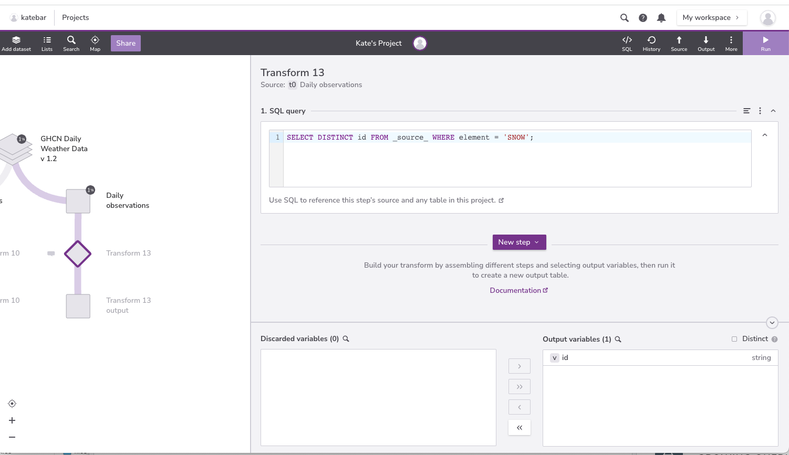{#id .class border=5px alt=''}


{#id .class border=5px alt=''}

But remember:
`DISTINCT` is applied to the values displayed in the chosen columns,
not to the entire rows as they are being processed.

:::::::::::::::::::::::::::::::::::::::::  callout

## Growing Queries

What we have just done is how most people "grow" their SQL queries.
We started with something simple that did part of what we wanted,
then added more clauses one by one,
testing their effects as we went.
This is a good strategy --- in fact,
for complex queries it's often the *only* strategy --- but
it depends on quick turnaround,
and on us recognizing the right answer when we get it.

The best way to achieve a quick turnaround is often
to put a subset of data in a temporary database
and run our queries against that,
or to fill a small database with synthesized records.
For example,
instead of trying our queries against an actual database of 20 million Australians,
we could run it against a sample of ten thousand,
or write a small program to generate ten thousand random (but plausible) records
and use that.


::::::::::::::::::::::::::::::::::::::::::::::::::

:::::::::::::::::::::::::::::::::::::::  challenge

## Fix This Query

Suppose we want to select all stations that lie within 30 degrees of the equator.
Our first query is:

```sql
SELECT * FROM _source_  WHERE (latitude > -30) OR (latitude < 30);
```

Explain why this is wrong,
and rewrite the query so that it is correct.

:::::::::::::::  solution

## Solution

Because we used `OR`, a site on the South Pole for example will still meet
the second criteria and thus be included. Instead, we want to restrict this
to sites that meet *both* criteria:

```sql
SELECT * FROM _source_  WHERE (latitude > -30) AND (latitude < 30);

```

:::::::::::::::::::::::::

::::::::::::::::::::::::::::::::::::::::::::::::::

:::::::::::::::::::::::::::::::::::::::  challenge

## Finding Outliers

We see that some observations have negative values. Let's make sure these are not incorrect data.
Using the the `Daily observations` table, write a query that selects unique observations with values less than 0.
Then, look up these observation types in the [GHCND Documentation](https://www.ncei.noaa.gov/data/global-historical-climatology-network-daily/doc/GHCND_documentation.pdf). Is it possible for these observation types to have negative values?

:::::::::::::::  solution

## Solution

```sql
SELECT DISTINCT element FROM _source_ WHERE value < 0;
```


| element  |  
| ------ | 
| TAVG    | 
| SX32    |
| SN52    | 
| TMIN    |
| SX02    | 
| SN32    |
| MNPN    |
| TMAX    |
| EVAP    |
| TOBS    |
| MXPN    |
| DAPR    |
| MDTN    |
| SN02    |

At least for some of these observations, negative values seem possible. For example,
TOBS is temperature at the time of observation. Temperatures can in fact be negative.

:::::::::::::::::::::::::

::::::::::::::::::::::::::::::::::::::::::::::::::

:::::::::::::::::::::::::::::::::::::::  challenge

## Matching Patterns

Which of these expressions are true?

1. `'a' LIKE 'a'`
2. `'a' LIKE '%a'`
3. `'beta' LIKE '%a'`
4. `'alpha' LIKE 'a%%'`
5. `'alpha' LIKE 'a%p%'`

:::::::::::::::  solution

## Solution

1. True because these are the same character.
2. True because the wildcard can match *zero* or more characters.
3. True because the `%` matches `bet` and the `a` matches the `a`.
4. True because the first wildcard matches `lpha` and the second wildcard matches zero characters (or vice versa).
5. True because the first wildcard matches `l` and the second wildcard matches `ha`.
  
  

:::::::::::::::::::::::::

::::::::::::::::::::::::::::::::::::::::::::::::::

:::::::::::::::::::::::::::::::::::::::: keypoints

- Use WHERE to specify conditions that records must meet in order to be included in a query's results.
- Use AND, OR, and NOT to combine tests.
- Filtering is done on whole records, so conditions can use fields that are not actually displayed.
- Write queries incrementally.

::::::::::::::::::::::::::::::::::::::::::::::::::


