::::::::::::::::::::::::::::::::::::::: objectives

- Write queries that calculate new values for each selected record.

::::::::::::::::::::::::::::::::::::::::::::::::::

:::::::::::::::::::::::::::::::::::::::: questions

- How can I calculate new values on the fly?

::::::::::::::::::::::::::::::::::::::::::::::::::

We realize that the reported precipitation measurements
may need to be corrected upward by 5%.
Rather than modifying the stored data,
we can do this calculation on the fly
as part of our query:

```sql
SELECT value AS original_value, value * 1.05 AS updated_value FROM _source_ 
  WHERE element = "PRCP" AND value > 0;
```

When we run the query,
the expression `value * 1.05` is evaluated for each row where the element is precipitation and the measurement is greater than 0.

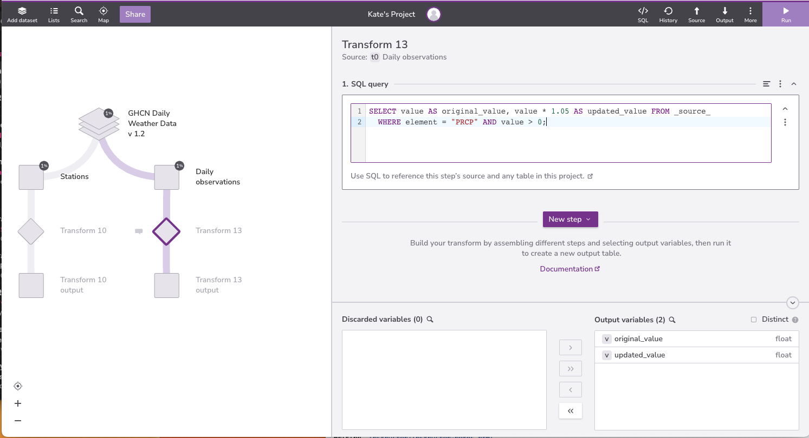{#id .class border=5px alt=''}


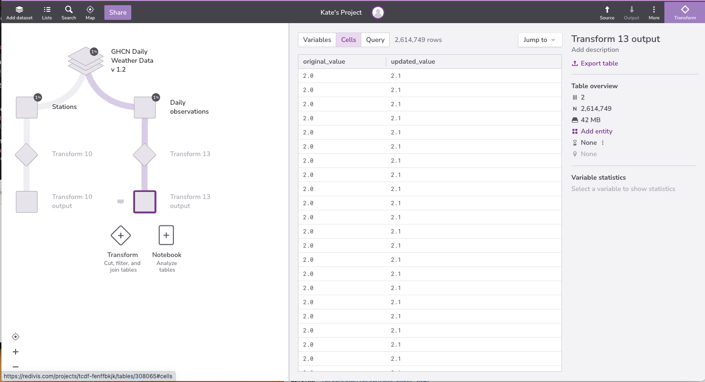{#id .class border=5px alt=''}


:::::::::::::::::::::::::::::::::::::::::  callout

## Renaming variables

We can use the keyword `AS` to rename the variables in our output. SQL allows us to rename our fields, any field for that matter, whether it was calculated or one of the existing fields in our database, for succinctness and clarity. In Redivis, we **must** rename calculated variables, or Redivis will throw an error.


::::::::::::::::::::::::::::::::::::::::::::::::::


Expressions can use any of the fields,
all of usual arithmetic operators,
and a variety of common functions.
(Exactly which ones depends on which database manager is being used.)
For example,
we can convert average temperature readings from Celsius to Fahrenheit
and round to one decimal place:

```sql
SELECT value AS celsius, round(value * 9/5 + 32,1) AS fahrenheit 
  FROM _source_ WHERE element = 'TAVG' AND value > 0;
```

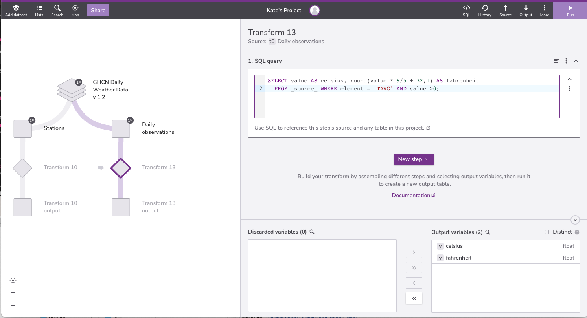{#id .class border=5px alt=''}


{#id .class border=5px alt=''}


We can also combine values from different fields,
for example by using the string concatenation operator `||`:

```sql
SELECT DISTINCT date || ': ' || time  AS date_time FROM _source_;
```

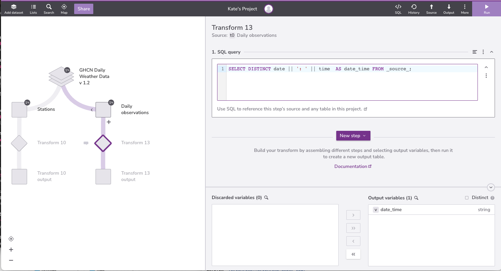{#id .class border=5px alt=''}


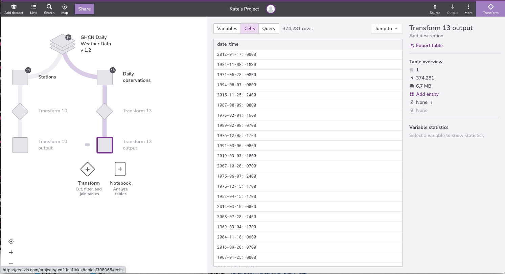{#id .class border=5px alt=''}

:::::::::::::::::::::::::::::::::::::::  challenge

## Converting units of measurement

The average daily wind speed is measured in tenths of meters per second.
Write a query that returns wind speed in tenths of meters per minute
from the `Daily observations` table.

:::::::::::::::  solution

## Solution

```sql
SELECT value AS per_second, (value * 60) AS per_minute FROM _source_ 
  WHERE element = 'AWND' AND value >0;
```

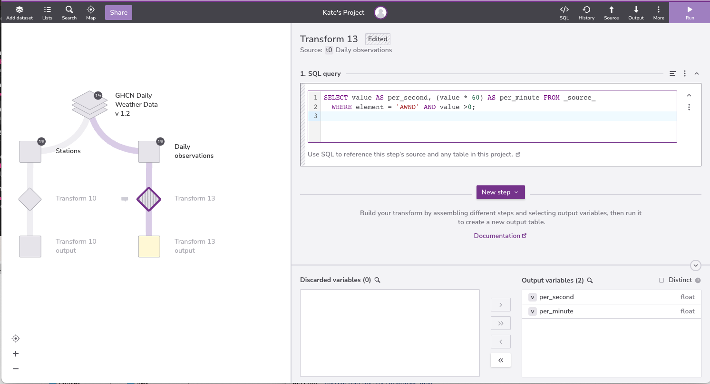{#id .class border=5px alt=''}


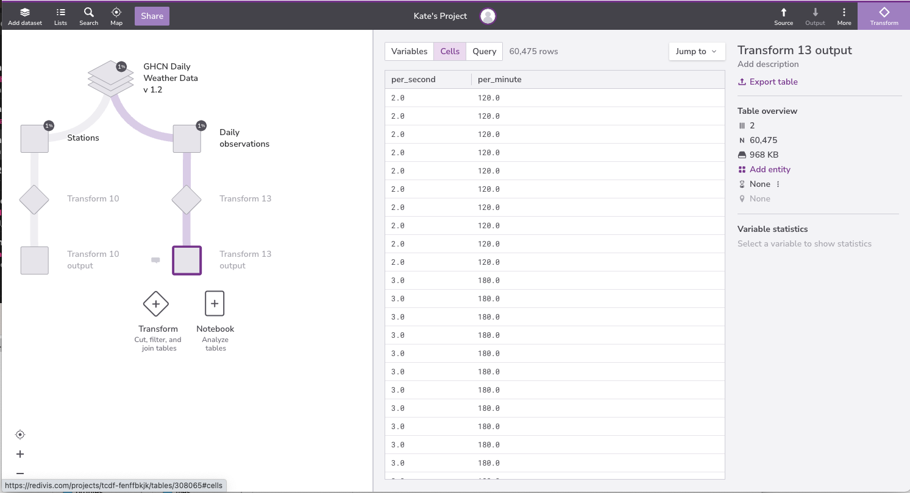{#id .class border=5px alt=''}


:::::::::::::::::::::::::

::::::::::::::::::::::::::::::::::::::::::::::::::

:::::::::::::::::::::::::::::::::::::::  callout

## Unions

The `UNION ALL` operator combines the results of two queries. 
`UNION ALL` will not eliminate duplicate rows.

The `UNION DISTINCT` operator also combines the results of two queries, and then
does a `SELECT DISTINCT` on the results set.

```sql
SELECT * FROM _source_ WHERE element = 'AWND' 
  UNION DISTINCT
  SELECT * FROM _source_ WHERE element = 'PRCP';
```

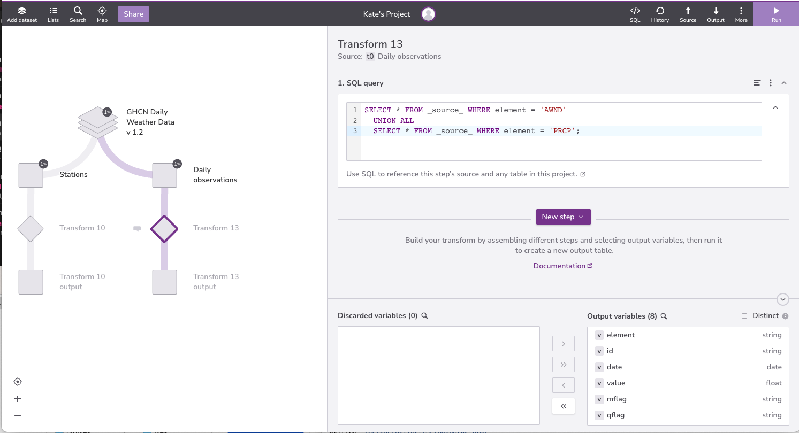{#id .class border=5px alt=''}


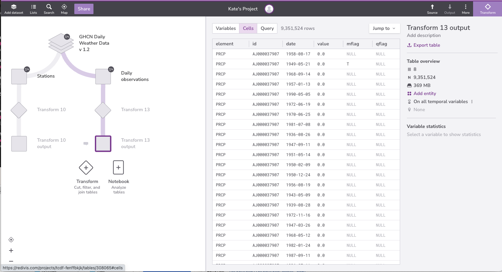{#id .class border=5px alt=''}

::::::::::::::::::::::::::::::::::::::::::::::::::

:::::::::::::::::::::::::::::::::::::::  challenge

## Selecting Major Site Identifiers

In the `Daily observations` table, `time` is formatted as a string.

The substring function `substr(X, I, [L])`
returns the substring of X starting at index I, with an optional length L.

Use the substring function to return the hour daily observations were made, sorted from greatest to smallest.

:::::::::::::::  solution

## Solution

```sql
SELECT SUBSTR(time, 1, 2) AS hour FROM _source_ ORDER BY hour DESC;
```

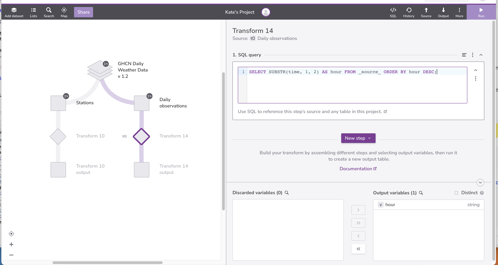{#id .class border=5px alt=''}


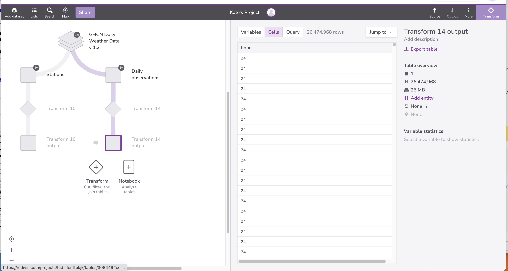{#id .class border=5px alt=''}

:::::::::::::::::::::::::

::::::::::::::::::::::::::::::::::::::::::::::::::

:::::::::::::::::::::::::::::::::::::::: keypoints

- Queries can do the usual arithmetic operations on values.
- Use UNION to combine the results of two or more queries.

::::::::::::::::::::::::::::::::::::::::::::::::::


