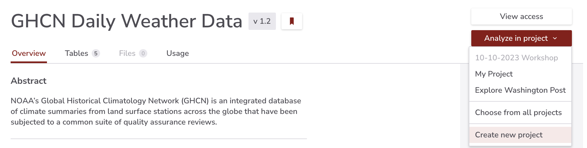
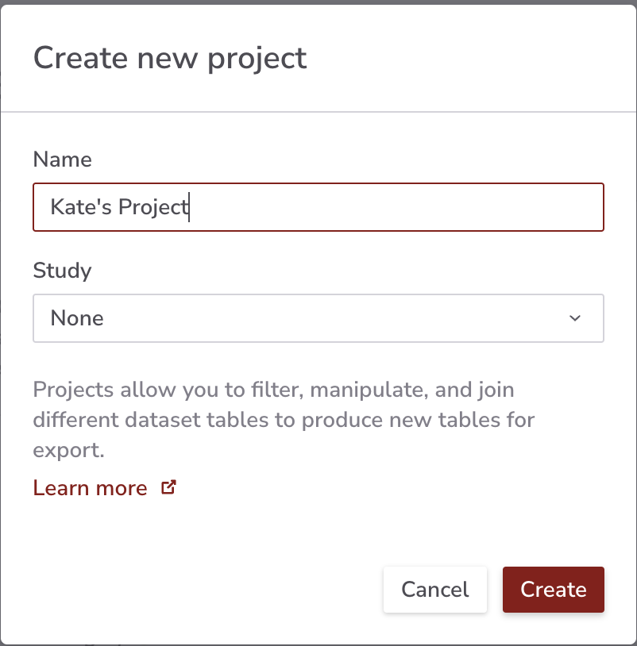
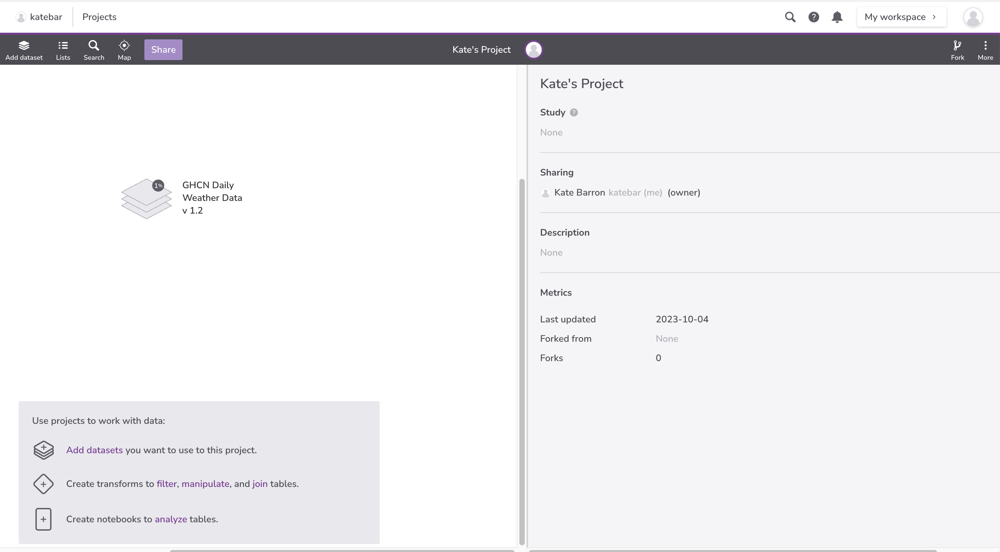

**Note**: This lesson is adapted from [Software Carpentry: Databases and SQL](https://swcarpentry.github.io/sql-novice-survey/).

**Note**: For more information about Redivis Projects, please see [Work with data in a project](https://docs.redivis.com/guides/work-with-data-in-a-project).

1. [Launch GHCN Daily Weather Data](https://redivis.com/datasets/mg94-6t8b2j4pk)

2. Select **Analyze in Project** and then **Create new project**.

{#id .class border=5px alt=''}

2. Name your project and select **Create**.

{#id .class width=50% height=50% border=5px alt=''} 

3. You will be redirected to your Project.

{#id .class border=5px alt=''}

